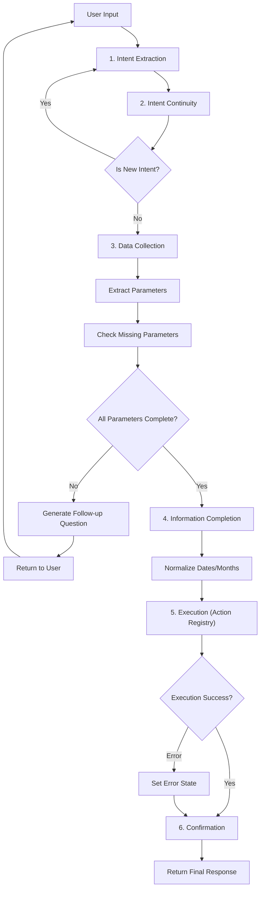

# LangGraph Workflow: Routing, Nodes & Conditions

## 🎯 **Overview**
Single-state LangGraph implementation with universal data collection for voice command processing. The workflow uses a **linear pipeline with conditional branching** based on state flags.

## 📂 **File Organization**

### **Routing Code Location**
Following clean architecture best practices, routing logic is centralized:

```
src/lib/langGraph/
├── workflows/
│   ├── coreRouter.ts           # Main workflow orchestrator
│   ├── definitions/
│   │   └── core.ts            # Declarative edge definitions
│   └── conditions/
│       └── intent.ts          # Pure guard functions
├── nodes/
│   ├── intentExtraction.ts    # Node 1: Extract intent
│   ├── intentContinuity.ts    # Node 2: Check continuity
│   ├── dataCollection.ts      # Node 3: Collect parameters
│   ├── informationCompletion.ts # Node 4: Normalize data 🆕
│   ├── execution.ts           # Node 5: Execute via actions
│   ├── confirmation.ts        # Node 6: Generate response
│   └── actions/               # Action executors 🆕
│       ├── index.ts           # ACTION_REGISTRY
│       ├── applyLeave.ts      # Direct DB action
│       ├── clockIn.ts         # Service action
│       └── view*.ts           # Navigation actions
└── types/
    └── state.ts               # VoiceCommandState definition
```

## 🔄 **Workflow Flow Diagram**



## 🎯 **Core Pipeline Execution**

### **Router Function: runCorePipeline()**
**Location**: src/lib/langGraph/workflows/coreRouter.ts

#### **Execution Sequence**

**Step 1: Intent Extraction** (Always Runs)
- Extracts intent and parameters from user input using OpenAI
- Line 22-31 in coreRouter.ts

**Step 2: Intent Continuity** (Always Runs)
- Checks if current message is new intent or continuation
- Line 29-37 in coreRouter.ts

**Step 3: Data Collection** (Always Runs)
- Computes missing parameters and asks for them
- Line 35-43 in coreRouter.ts

**Routing Condition #1: Data Completeness Check**
- Line 45-49 in coreRouter.ts
- Guard Function: isDataCollectionIncomplete(state)
- Logic: return !state.isComplete
- Action: If incomplete, exit pipeline and return to user
- Next Turn: User provides more data, re-enter pipeline at Step 1

**Step 4: Information Completion** 🆕 (Only if isComplete = true)
- Normalizes subjective data (dates, months) to concrete values
- Uses OpenAI with pre-calculated month names for accuracy
- Examples: "tomorrow" → "2025-10-01", "last month" → "August"

**Step 5: Execution** (Only if isComplete = true)
- Looks up action executor in ACTION_REGISTRY by intent
- Dispatches to appropriate action executor
- Actions may: modify database, return navigation destination, call services
- Line 47-55 in coreRouter.ts

**Step 6: Confirmation** (Always after Execution)
- Generates final user-facing response
- Line 53-61 in coreRouter.ts

## 🔍 **Routing Conditions & Guards**

### **1. Intent Continuity Condition**
**Location**: src/lib/langGraph/nodes/intentContinuity.ts:40-66

#### **Check 1: First Message Detection**
- Line 136-139 in intentContinuity.ts
- Trigger: First message in session
- Result: Always treated as new intent
- Code: if (state.conversationHistory.length <= 1) return { isSame: false }

#### **Check 2: Missing Current Intent**
- Line 142-144 in intentContinuity.ts
- Trigger: No active intent in state
- Result: Extract new intent
- Code: if (!state.currentIntent || state.currentIntent === '') return { isSame: false }

#### **Check 3: OpenAI Continuity Analysis**
- Line 151-156 in intentContinuity.ts
- Trigger: Has active intent, not first message
- Method: OpenAI analyzes semantic similarity between current and previous intent
- Returns:
  * isSame: true → Continue with current intent, merge newData
  * isSame: false → New intent detected, tag for re-extraction

**Routing Action When New Intent Detected:**
- Line 45-52 in intentContinuity.ts
- Tags message metadata with: isNewIntent: true, route: 'intent_extraction'
- Current Behavior: Router doesn't explicitly check this tag yet
- Intent continuity handles inline by resetting state

### **2. Data Collection Completeness Condition**
**Location**: src/lib/langGraph/workflows/conditions/intent.ts

#### **Guard: isDataCollectionComplete(state)**
- Line 3-5 in conditions/intent.ts
- Used By: Router line 46
- Condition: state.isComplete === true
- Action: Proceed to Execution node

#### **Guard: isDataCollectionIncomplete(state)**
- Line 7-9 in conditions/intent.ts
- Used By: Router line 46 (inverted)
- Condition: state.isComplete === false
- Action: Exit pipeline, return to user

**How isComplete is Set:**
- In dataCollection.ts line 65-88
- if (missing.length > 0): isComplete = false, requiresConfirmation = true
- else: isComplete = true, requiresConfirmation = false

### **3. Missing Parameters Computation**
**Location**: src/lib/langGraph/nodes/dataCollection.ts:12-20

**Function: computeMissingParameters(intent, requiredData)**

Checks performed:
1. Parameter is undefined
2. Parameter is null
3. Parameter is empty string
4. Parameter doesn't exist in requiredData

Returns: Array of missing parameter names

### **4. Execution Error Handling**
**Location**: src/lib/langGraph/nodes/execution.ts:83-96

**Condition**: Exception thrown during execution
**Action**: 
- Set error state
- Mark isComplete: false (force re-collection)
- Set requiresConfirmation: true
- Proceed to confirmation with error

## 📊 **Declarative Workflow Definition**

**Location**: src/lib/langGraph/workflows/definitions/core.ts

**Status**: ⚠️ Scaffold created, not yet wired to runtime router

**Defined Edges:**
- intent_extraction → intent_continuity
- intent_continuity → data_collection
- data_collection → execution (guard: isDataCollectionComplete)
- data_collection → data_collection (guard: isDataCollectionIncomplete, loop back)
- execution → confirmation

**Future Enhancement**: This definition can be used to drive a generic graph executor instead of the current imperative router.

## 🔄 **Multi-Turn Conversation Flow**

### **Example: Apply Leave Request**

#### **Turn 1: Initial Request**
```
User: "I want to apply for leave"
├─ [1] Intent Extraction → intent = "apply_leave"
├─ [2] Intent Continuity → (first message, passes through)
├─ [3] Data Collection
│   ├─ Extract params: {}
│   ├─ Missing: [date_range, leave_type, reason]
│   └─ isComplete = false
└─ [ROUTE] Return: "When would you like to take leave?"
```
**Routing Decision**: !collected.value.isComplete → Exit at line 46

#### **Turn 2: Provide Dates**
```
User: "From Monday to Wednesday next week"
├─ [1] Intent Extraction → Extract date_range
├─ [2] Intent Continuity
│   ├─ Check: isSame? → YES (continuing "apply_leave")
│   └─ Merge: date_range into requiredData
├─ [3] Data Collection
│   ├─ Extract params: {date_range: "2025-10-06 to 2025-10-08"}
│   ├─ Missing: [leave_type, reason]
│   └─ isComplete = false
└─ [ROUTE] Return: "What type of leave would you like to apply for?"
```
**Routing Decision**: !collected.value.isComplete → Exit at line 46

#### **Turn 3: Provide Leave Type**
```
User: "Sick leave because I have a doctor's appointment"
├─ [1] Intent Extraction → Extract leave_type + reason
├─ [2] Intent Continuity
│   ├─ Check: isSame? → YES
│   └─ Merge: {leave_type, reason} into requiredData
├─ [3] Data Collection
│   ├─ Extract params: {leave_type: "sick", reason: "doctor appointment"}
│   ├─ Missing: []
│   └─ isComplete = true ✓
├─ [ROUTE] Continue (line 51)
├─ [4] Information Completion 🆕
│   └─ Normalize: "Monday to Wednesday" → "2025-10-06" to "2025-10-08"
├─ [5] Execution → ACTION_REGISTRY['apply_leave']
│   └─ executeApplyLeave() → Direct database insert
├─ [6] Confirmation → "Your sick leave request has been submitted..."
└─ [RETURN] Final response
```
**Routing Decision**: collected.value.isComplete === true → Proceed to Information Completion → Execution

#### **Turn 4: New Intent**
```
User: "Show my attendance history"
├─ [1] Intent Extraction → intent = "view_attendance_history"
├─ [2] Intent Continuity
│   ├─ Check: isSame? → NO (new intent detected)
│   ├─ Tag: metadata.isNewIntent = true
│   └─ Reset: Clear previous intent data
├─ [3] Data Collection
│   ├─ Extract params: {}
│   ├─ Missing: [date_range]
│   └─ isComplete = false
└─ [ROUTE] Return: "Which period would you like to see?"
```
**Routing Decision**: Intent switch handled, new data collection starts

## 🧪 **State Flags Reference**

| Flag | Type | Set By | Used By | Purpose |
|------|------|---------|---------|---------|
| isComplete | boolean | Data Collection | Router (line 46) | Determines if execution should proceed |
| requiresConfirmation | boolean | Data Collection, Execution | UI/Frontend | Indicates user response needed |
| currentIntent | string | Intent Extraction | All nodes | Active command being processed |
| requiredData | object | Data Collection, Info Completion | Execution | Collected & normalized parameters |
| missingParameters | string[] | Data Collection | Data Collection | Tracks what's still needed |
| conversationHistory | array | All nodes | Intent Continuity, Data Collection | Multi-turn context |
| error | string? | Execution | Confirmation | Error message if execution failed |
| executionResult | any? | Execution | Confirmation | Command execution output (may include `destination`) |

## 🎯 **Condition Evaluation Summary**

### **At Router Level (coreRouter.ts)**
1. **Line 46**: if (!collected.value.isComplete)
   - Guard: isDataCollectionIncomplete()
   - Action: Exit pipeline, return to user

### **At Node Level**

#### **Intent Continuity Node**
1. **Line 136**: First message check
2. **Line 142**: Missing intent check  
3. **Line 151**: OpenAI semantic continuity analysis

#### **Data Collection Node**
1. **Line 59**: computeMissingParameters() check
2. **Line 65**: if (missing.length > 0) → incomplete
3. **Line 85**: else → complete

#### **Execution Node**
1. **Line 83-96**: Try/catch error handling
2. Success sets isComplete: true
3. Error sets isComplete: false

#### **Confirmation Node**
1. **Line 70**: if (state.error) → error response
2. **Line 74**: if (executionResult.success === false) → failure response
3. **Line 79**: Switch on intent → success responses

## 🚦 **Routing Decision Tree**

```
START Pipeline
│
├─ Run Intent Extraction (always)
├─ Run Intent Continuity (always)
│  └─ If new intent: resets state internally
│
├─ Run Data Collection (always)
│  └─ Computes missing parameters
│
├─ DECISION POINT (line 46)
│  │
│  ├─ IF isComplete = false
│  │  └─ RETURN state → User provides more data → Re-enter pipeline
│  │
│  └─ IF isComplete = true
│     ├─ Run Information Completion 🆕
│     │  └─ Normalize dates/months to concrete values
│     │
│     ├─ Run Execution (Action Registry)
│     │  ├─ Lookup: ACTION_REGISTRY[intent] → actionExecutor
│     │  ├─ Execute: actionExecutor({ userId, ...normalizedData })
│     │  ├─ On success: set executionResult (may include destination)
│     │  └─ On error: set error state
│     │
│     └─ Run Confirmation
│        └─ RETURN final response
```

## 📝 **Adding New Routing Conditions**

To add a new routing condition:

### **Step 1: Define guard function**
Location: workflows/conditions/intent.ts
```typescript
export function myNewCondition(state: VoiceCommandState): boolean {
  return /* your logic */;
}
```

### **Step 2: Add to workflow definition**
Location: workflows/definitions/core.ts
```typescript
edges: [
  { from: 'node_a', to: 'node_b', guard: 'myNewCondition' }
]
```

### **Step 3: Use in router**
(when declarative edges are wired)
```typescript
if (myNewCondition(state)) {
  // route to appropriate node
}
```

---

## 🆕 **Adding New Actions (Action Registry Pattern)**

### **To Add a New Intent with Action:**

**Step 1: Define Intent Parameters**
Location: `src/lib/langGraph/config/parameterRequirements.ts`
```typescript
export const PARAMETER_REQUIREMENTS = {
  'my_new_intent': {
    intent: 'my_new_intent',
    description: 'Description of what this does',
    category: 'mutation', // or 'query', 'action', 'tracking'
    workflow: 'my_workflow',
    parameters: [
      { name: 'param1', type: 'string', required: true, ... }
    ]
  }
};
```

**Step 2: Create Action Executor**
Location: `src/lib/langGraph/nodes/actions/myNewAction.ts`
```typescript
export interface MyNewActionParams {
  userId: string;
  param1: string;
  // ... other params
}

export interface MyNewActionResult {
  success: boolean;
  message: string;
  data?: {
    destination?: string; // For navigation actions
    // ... other result data
  };
  error?: string;
}

export async function executeMyNewAction(
  params: MyNewActionParams
): Promise<MyNewActionResult> {
  try {
    // Option 1: Direct database operation
    await connectDB();
    const result = await MyModel.create({ ... });
    
    // Option 2: Navigation
    return {
      success: true,
      message: 'Action completed',
      data: {
        destination: '/portal/my-page?param=value'
      }
    };
    
    // Option 3: Call existing service
    const result = await myService.doSomething(params);
    return { success: true, message: 'Done', data: result };
    
  } catch (error) {
    return {
      success: false,
      message: 'Failed to execute action',
      error: error instanceof Error ? error.message : 'UNKNOWN_ERROR'
    };
  }
}
```

**Step 3: Register Action**
Location: `src/lib/langGraph/nodes/actions/index.ts`
```typescript
import { executeMyNewAction } from './myNewAction';

export const ACTION_REGISTRY = {
  // ... existing actions
  'my_new_intent': executeMyNewAction,
};

export { executeMyNewAction } from './myNewAction';
```

**Step 4: Done!**
The system will automatically:
- Extract intent and parameters (Intent Extraction)
- Collect missing parameters (Data Collection)
- Normalize dates/months (Information Completion)
- Execute your action (Execution)
- Generate confirmation (Confirmation)

### **Action Types:**

**1. Mutation Actions (Database Operations)**
- Examples: `applyLeave`, `clockIn`
- Directly modify database
- Return success/failure with data

**2. Navigation Actions (Frontend Routing)**
- Examples: `viewTeamAttendance`, `viewAttendanceHistory`
- Return `destination` URL with query parameters
- Frontend navigates to the destination

**3. Service Actions (Call Existing Services)**
- Examples: `clockIn` (uses attendanceService)
- Wrap existing service layer
- Return service results

**4. Query Actions (Future)**
- Fetch and return data
- No state changes

### **Current Implemented Actions:**

| Intent | Type | Action File | Description |
|--------|------|-------------|-------------|
| `clock_in` | Service | `clockIn.ts` | Direct attendance service call |
| `clock_out` | Service | `clockOut.ts` | Direct attendance service call |
| `apply_leave` | Mutation | `applyLeave.ts` | Direct database insert with validations |
| `get_leave_balance` | Navigation | `getLeaveBalance.ts` | Navigate to leaves with filters |
| `view_attendance_history` | Navigation | `viewAttendanceHistory.ts` | Navigate to attendance with month |
| `view_team_attendance` | Navigation | `viewTeamAttendance.ts` | Navigate to team attendance view |
| `view_team_leaves` | Navigation | `viewTeamLeaves.ts` | Navigate to team leaves tab |

---

**Current Status**: 
- ✅ Action registry pattern fully implemented
- ✅ 7 intents with action executors
- ✅ Information completion for date normalization
- ⚠️ Declarative edges exist but are not yet wired to the runtime
