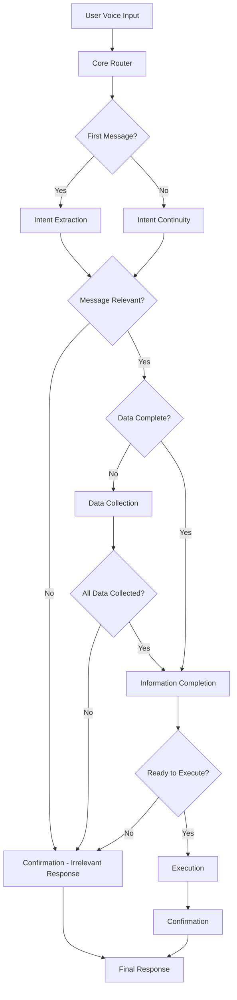
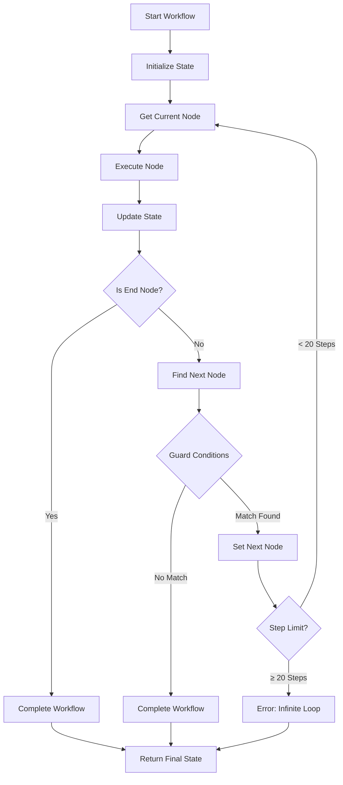
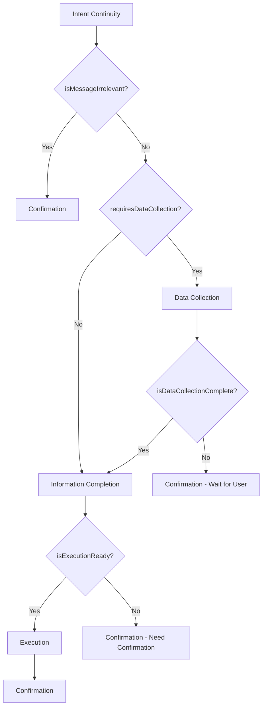
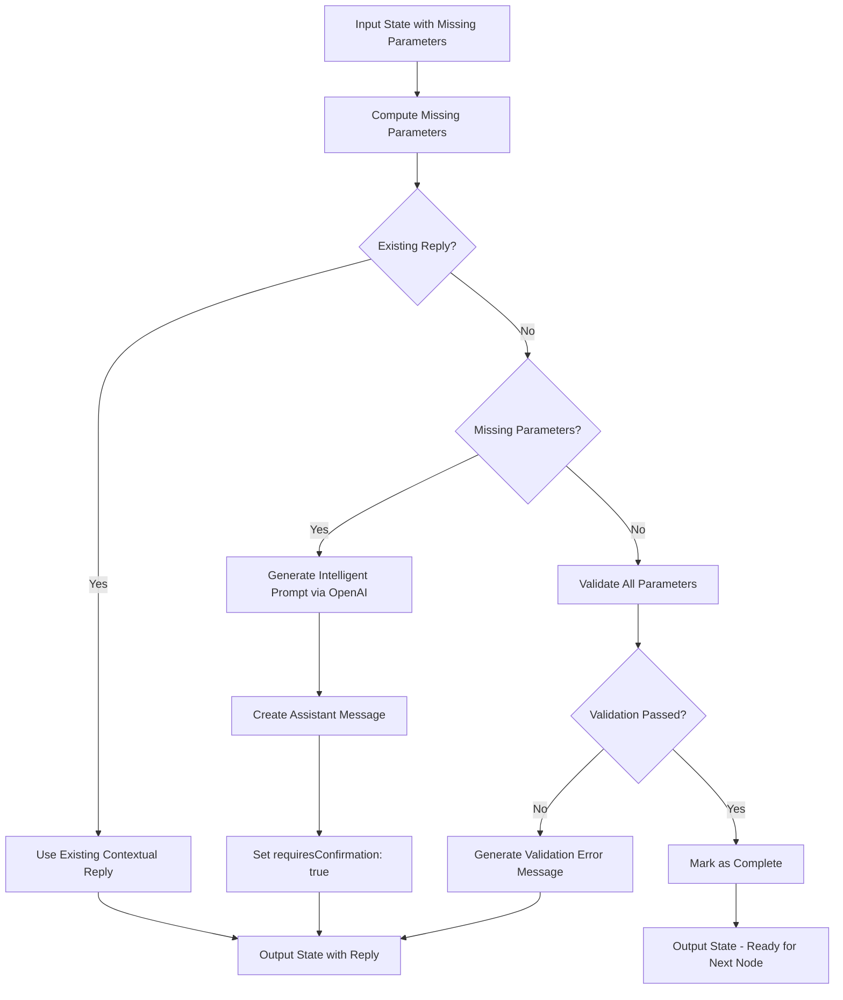
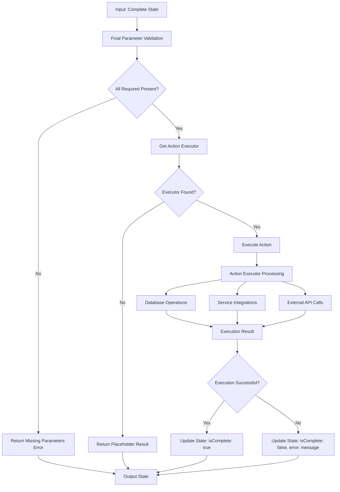
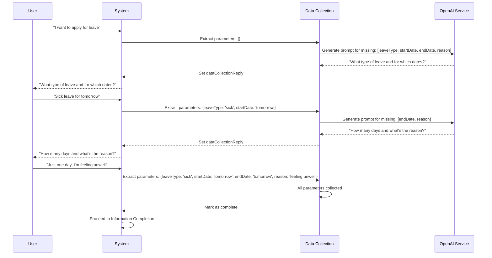
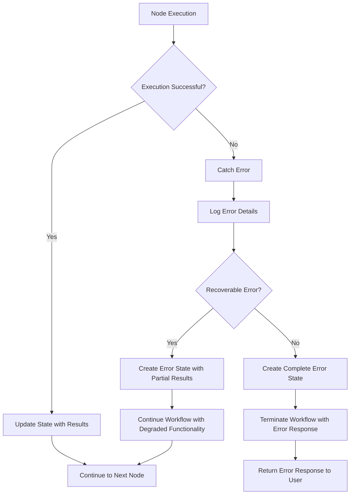
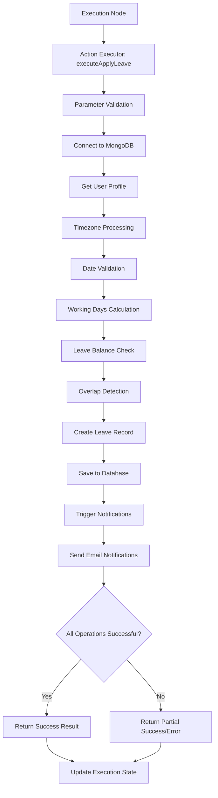
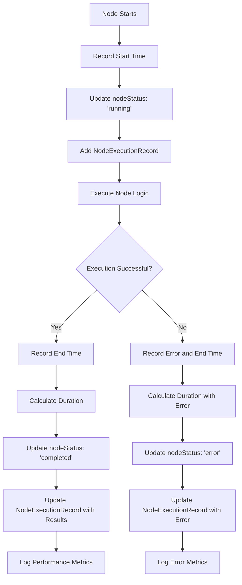

# LangGraph Agent Documentation

## Table of Contents

1. [System Overview](#system-overview)
2. [Architecture](#architecture)
3. [Workflow Engine](#workflow-engine)
4. [Processing Nodes](#processing-nodes)
   - [Intent Extraction Node](#intent-extraction-node)
   - [Intent Continuity Node](#intent-continuity-node)
   - [Data Collection Node](#data-collection-node)
   - [Information Completion Node](#information-completion-node)
   - [Execution Node](#execution-node)
   - [Confirmation Node](#confirmation-node)
5. [Node Activation and Routing](#node-activation-and-routing)
6. [Intent Configuration System](#intent-configuration-system)
7. [Action Execution System](#action-execution-system)
8. [State Management](#state-management)
9. [Data Flow Diagrams](#data-flow-diagrams)
10. [Integration Points](#integration-points)
11. [Extension Guide](#extension-guide)
12. [Code Examples](#code-examples)
13. [Troubleshooting](#troubleshooting)

---

## System Overview

The LangGraph Agent is a sophisticated voice command processing system built for the HR Dashboard application. It transforms natural language input from users into structured actions that interact with HR systems like attendance tracking, leave management, and team oversight.

### Purpose and Role

The LangGraph Agent serves as an intelligent intermediary between users and HR functionality, enabling employees and managers to:

- Clock in/out using voice commands
- Apply for leave with natural language descriptions
- Check leave balances and attendance history
- View team information and manage approvals
- Handle non-HR queries with contextual responses

### Key Characteristics

- **Declarative Workflow Engine**: Uses data-driven workflow definitions rather than hardcoded logic
- **Node-Based Processing**: Breaks down voice command processing into discrete, specialized nodes
- **Intent-Driven Architecture**: Recognizes user intentions and maps them to appropriate actions
- **State-Aware Processing**: Maintains conversation context and user session state
- **Extensible Design**: Easy to add new intents, nodes, and action executors

## Architecture

The LangGraph Agent follows a declarative workflow architecture with the following core principles:

### Core Principles

1. **Separation of Concerns**: Each node has a single, well-defined responsibility
2. **Declarative Routing**: Workflow paths are defined as data structures with guard conditions
3. **State Immutability**: State is transformed through nodes rather than mutated directly
4. **Error Resilience**: Graceful degradation and comprehensive error handling
5. **Extensibility**: New functionality can be added without modifying existing code

### High-Level Architecture



### System Components

#### 1. Workflow Engine (`workflowEngine.ts`)
- **Purpose**: Executes declarative workflow definitions
- **Responsibilities**: Node execution, routing decisions, state management
- **Key Features**: Guard-based routing, error handling, execution tracking

#### 2. Core Router (`coreRouter.ts`)
- **Purpose**: Main entry point and workflow orchestrator
- **Responsibilities**: Workflow building, state preparation, pipeline execution
- **Key Features**: Different flows for first vs. follow-up messages

#### 3. Processing Nodes
Six specialized nodes handle different aspects of voice command processing:
- **Intent Extraction**: Derives intent and entities from user input
- **Intent Continuity**: Determines if messages are new intents or continuations
- **Data Collection**: Gathers missing parameters with intelligent prompts
- **Information Completion**: Normalizes subjective information (dates, times)
- **Execution**: Executes commands using registered action executors
- **Confirmation**: Generates final responses and concludes processing

#### 4. Configuration System
- **Available Intents**: Central registry of supported voice commands
- **Parameter Requirements**: Validation rules and metadata for each intent
- **Action Registry**: Maps intents to their execution functions

#### 5. State Management
- **VoiceCommandState**: Unified state object that flows through the entire system
- **Conversation History**: Maintains context across multiple interactions
- **Node Progress Tracking**: Monitors execution status and performance

### Key Concepts

#### Intents
Structured representations of user intentions, categorized by operational nature:
- **Query**: Read-only operations (viewing data)
- **Mutation**: Create new records (applying for leave)
- **Action**: Modify existing records (approving requests)
- **Tracking**: Time-based state changes (clocking in/out)

#### Parameters
Data required to fulfill user intents, with comprehensive validation:
- **Required vs Optional**: Enforced through configuration
- **Type Validation**: String, date, number, boolean, enum types
- **Custom Validation**: Business logic constraints (minimum lengths, date ranges)

#### Workflows
Declarative definitions that specify how nodes are connected:
- **Nodes**: Map of available processing nodes
- **Edges**: Connections between nodes with optional guard conditions
- **Start/End Points**: Entry and exit points for workflow execution

#### State Evolution
The VoiceCommandState object evolves through the workflow:
- **Session Management**: User and session identification
- **Intent Processing**: Current intent and required data
- **Conversation Context**: Message history and context
- **Execution Status**: Progress tracking and results

## Workflow Engine

The Workflow Engine is the heart of the LangGraph Agent, implementing a declarative approach to voice command processing. Instead of hardcoded conditional logic, it uses data-driven workflow definitions with guard-based routing.

### Core Interfaces

#### WorkflowDefinition
```typescript
interface WorkflowDefinition {
  nodes: Map<string, WorkflowNode>;  // Available processing nodes
  edges: WorkflowEdge[];             // Connections between nodes
  startNode: string;                 // Entry point node ID
  endNodes: string[];                // Exit point node IDs
}
```

#### WorkflowEdge
```typescript
interface WorkflowEdge {
  from: string;                      // Source node ID
  to: string;                        // Destination node ID
  guard?: ConditionFunction;         // Optional routing condition
  label?: string;                    // Description for debugging
}
```

#### ConditionFunction
```typescript
type ConditionFunction = (state: VoiceCommandState) => boolean;
```

### Workflow Execution Lifecycle

The workflow engine follows a structured execution process:



### Key Functions

#### executeWorkflow()
The main workflow execution function:

```typescript
async function executeWorkflow(
  workflow: WorkflowDefinition,
  initialState: VoiceCommandState,
  workflowName: string = 'workflow'
): Promise<NodeOutput<VoiceCommandState>>
```

**Process:**
1. Initialize session logging
2. Execute nodes sequentially until end node or no next node
3. Validate state after each node execution
4. Handle errors with graceful degradation
5. Return final state with execution results

#### executeNode()
Executes a single node with proper state management:

```typescript
async function executeNode(
  node: WorkflowNode,
  state: VoiceCommandState,
  sessionId: string,
  workflowName: string,
  stepNumber: number
): Promise<NodeOutput<VoiceCommandState>>
```

**Process:**
1. Update state to show node is running
2. Prepare node input based on node type
3. Execute node with proper error handling
4. Update state to show node completed
5. Log execution metrics and results

#### findNextNode()
Determines the next node based on edges and guard conditions:

```typescript
function findNextNode(
  currentNodeId: string,
  state: VoiceCommandState,
  edges: WorkflowEdge[],
  sessionId: string
): string | null
```

**Process:**
1. Filter edges that originate from current node
2. Evaluate guard conditions in order
3. Return first matching destination node
4. Return null if no conditions match (workflow complete)

### Edge-Based Routing System

The routing system uses edges with optional guard conditions to determine workflow paths:

#### First Message Flow
```typescript
const firstMessageEdges: WorkflowEdge[] = [
  {
    from: 'intent_extraction',
    to: 'confirmation',
    guard: (state) => isMessageIrrelevant(state),
    label: 'irrelevant message'
  },
  {
    from: 'intent_extraction',
    to: 'data_collection',
    guard: (state) => requiresDataCollection(state),
    label: 'needs data'
  },
  {
    from: 'intent_extraction',
    to: 'information_completion',
    label: 'has all data'  // Default path (no guard)
  }
  // ... more edges
];
```

#### Follow-up Message Flow
```typescript
const followUpEdges: WorkflowEdge[] = [
  {
    from: 'intent_continuity',
    to: 'confirmation',
    guard: (state) => isMessageIrrelevant(state),
    label: 'irrelevant message'
  },
  {
    from: 'intent_continuity',
    to: 'data_collection',
    guard: (state) => requiresDataCollection(state),
    label: 'needs data'
  }
  // ... more edges
];
```

### Safety Mechanisms

#### Infinite Loop Prevention
- Maximum 20 steps per workflow execution
- Throws error if limit exceeded
- Prevents runaway processes

#### State Validation
After each node execution, the engine validates:
- `sessionId` is present
- `userId` is present  
- `currentIntent` is defined (not undefined)

#### Error Handling
- Node-level errors are caught and logged
- Workflow continues with error state for graceful degradation
- Failed workflows return diagnostic information

### Workflow Building

The Core Router builds different workflows based on message type:

```typescript
function buildCoreWorkflow(isFirstMessage: boolean): WorkflowDefinition {
  const nodes = new Map();
  nodes.set('intent_extraction', intentExtractionNode);
  nodes.set('intent_continuity', intentContinuityNode);
  nodes.set('data_collection', dataCollectionNode);
  nodes.set('information_completion', informationCompletionNode);
  nodes.set('execution', executionNode);
  nodes.set('confirmation', confirmationNode);

  const edges = isFirstMessage ? firstMessageEdges : followUpEdges;

  return {
    nodes,
    edges,
    startNode: isFirstMessage ? 'intent_extraction' : 'intent_continuity',
    endNodes: ['confirmation']
  };
}
```

### Performance Considerations

- **Node Execution Tracking**: Each node execution is timed and logged
- **State Size Management**: Large conversation histories are truncated
- **Memory Efficiency**: Immutable state updates prevent memory leaks
- **Concurrent Safety**: Each workflow execution is isolated

## Processing Nodes

The LangGraph Agent uses six specialized processing nodes, each with a specific responsibility in the voice command processing pipeline. Each node implements the `LangGraphNode` interface and processes the `VoiceCommandState` object.

### Intent Extraction Node

**Purpose**: Derives raw intent and entities from user input using OpenAI integration.

**Node ID**: `intent_extraction`

**When Activated**: 
- First message in a conversation
- When a new intent is detected in follow-up messages

**Input**: 
```typescript
NodeInput<{ text: string }>
```

**Key Responsibilities**:
1. **Intent Recognition**: Uses OpenAI to identify user intent from natural language
2. **Parameter Extraction**: Extracts relevant parameters from user input
3. **Relevance Checking**: Determines if the message is HR-related or irrelevant
4. **Confidence Assessment**: Evaluates confidence level of intent recognition

**Processing Logic**:
```typescript
// 1. Initialize OpenAI service and extract intent
const intentResult = await openaiService.extractIntent(value.text, context);

// 2. Handle irrelevant messages
if (intentResult.isRelevant === false) {
  // Generate contextual response and mark as complete
  return irrelevantMessageResponse;
}

// 3. Process HR-related intents
const extractedParameters = intentResult.parameters || {};
const requiredData = buildRequiredData(intentResult.intent, extractedParameters);

// 4. Check completeness and confidence
const missingParams = getRequiredParameters(intent).filter(/* missing check */);
const isComplete = missingParams.length === 0 && intentResult.confidence >= 0.7;
```

**Output State Changes**:
- Sets `currentIntent` to recognized intent
- Populates `requiredData` with extracted parameters
- Updates `missingParameters` with missing required fields
- Sets `isComplete` based on parameter completeness and confidence
- Adds user message to `conversationHistory`

**Error Handling**:
- OpenAI API failures are caught and re-thrown with context
- Invalid intent configurations are handled gracefully
- Low confidence intents are marked for confirmation

### Intent Continuity Node

**Purpose**: Determines if follow-up messages are new intents or continuations of the current intent.

**Node ID**: `intent_continuity`

**When Activated**: 
- Follow-up messages in existing conversations
- When `isFirstMessage` is false

**Input**: 
```typescript
NodeInput<VoiceCommandState>
```

**Key Responsibilities**:
1. **Continuity Analysis**: Determines if message continues current intent or starts new one
2. **Parameter Extraction**: Extracts additional parameters from continuation messages
3. **Context Preservation**: Maintains conversation context for irrelevant messages
4. **Intent Switching**: Handles transitions to new intents

**Processing Logic**:
```typescript
// 1. Get latest user message
const latestMessage = state.conversationHistory[state.conversationHistory.length - 1];

// 2. Check intent continuity using OpenAI
const continuityResult = await checkIntentContinuity(latestMessage.content, state);

// 3. Handle different scenarios
if (!continuityResult.isSame) {
  if (continuityResult.isRelevant === false) {
    // Non-HR message: preserve context, generate response
    return preserveContextResponse;
  } else {
    // New HR intent: delegate to intent extraction
    return newIntentResponse;
  }
} else {
  // Continuation: merge new data with existing
  const mergedData = { ...state.requiredData, ...continuityResult.newData };
  return continuationResponse;
}
```

**Output State Changes**:
- Updates `requiredData` with newly extracted parameters
- Modifies `missingParameters` based on new data
- Preserves `currentIntent` for continuations
- Updates `isComplete` when all parameters are collected
- Adds contextual responses to `conversationHistory`

**Special Handling**:
- **Context Preservation**: For irrelevant messages, maintains original intent context
- **Intent Delegation**: Tags messages for routing to intent extraction when new intents detected
- **Parameter Merging**: Intelligently combines new parameters with existing data

### Data Collection Node

**Purpose**: Collects missing parameters using OpenAI-powered intelligent prompts.

**Node ID**: `data_collection`

**When Activated**: 
- When `requiresDataCollection(state)` returns true
- Missing required parameters detected

**Input**: 
```typescript
NodeInput<VoiceCommandState>
```

**Key Responsibilities**:
1. **Missing Parameter Detection**: Identifies which required parameters are missing
2. **Intelligent Prompting**: Generates contextual prompts for missing data
3. **Parameter Validation**: Validates collected parameters against business rules
4. **Contextual Response Handling**: Manages existing contextual replies

**Processing Logic**:
```typescript
// 1. Compute missing parameters
const missing = computeMissingParameters(state.currentIntent, state.requiredData);

// 2. Handle existing contextual replies
if (state.dataCollectionReply) {
  return useExistingReply;
}

// 3. Generate intelligent prompts for missing data
if (missing.length > 0) {
  const reply = await openaiService.generateDataCollectionReply(
    state.currentIntent,
    state.requiredData,
    missing,
    state.conversationHistory,
    parameterConfig
  );
  return promptForMissingData;
}

// 4. Validate complete parameters
const validationResult = validateAllParameters(state.currentIntent, state.requiredData);
if (!validationResult.valid) {
  return validationErrorResponse;
}

// 5. Mark as complete
return completeDataCollection;
```

**Output State Changes**:
- Updates `missingParameters` with current missing fields
- Sets `dataCollectionReply` with intelligent prompts
- Updates `isComplete` when all data is collected and validated
- Sets `requiresConfirmation` for user interaction
- Adds assistant messages to `conversationHistory`

**Validation Features**:
- **Type Validation**: Ensures parameters match expected types
- **Business Rule Validation**: Applies custom validation logic
- **Length Constraints**: Enforces minimum/maximum length requirements
- **Pattern Matching**: Validates against regular expressions

### Information Completion Node

**Purpose**: Normalizes subjective information (dates, times) to concrete values using current context.

**Node ID**: `information_completion`

**When Activated**: 
- After data collection is complete
- Before execution when `isExecutionReady(state)` is true

**Input**: 
```typescript
NodeInput<VoiceCommandState>
```

**Key Responsibilities**:
1. **Subjective Information Detection**: Identifies relative dates/times in parameters
2. **Context-Aware Normalization**: Converts subjective terms to concrete values
3. **Timezone Handling**: Applies user timezone for accurate date calculations
4. **Pass-through Optimization**: Skips processing when no normalization needed

**Processing Logic**:
```typescript
// 1. Check for subjective information
const needsNormalization = hasSubjectiveInformation(state.requiredData);
if (!needsNormalization) {
  return passThrough;
}

// 2. Prepare normalization context
const context = {
  currentDate: now.toISOString(),
  currentTime: now.toLocaleTimeString(),
  timezone: userTimezone,
  dayOfWeek: now.toLocaleDateString('en-US', { weekday: 'long' }),
  intent: state.currentIntent
};

// 3. Normalize using OpenAI
const normalizedData = await openaiService.normalizeSubjectiveInformation(
  state.requiredData,
  context
);

return normalizedState;
```

**Subjective Patterns Detected**:
- Relative dates: "tomorrow", "yesterday", "next Monday"
- Time references: "now", "tonight", "asap"
- Duration expressions: "in 3 days", "2 weeks ago"
- Contextual terms: "this week", "next month"

**Output State Changes**:
- Updates `requiredData` with normalized concrete values
- Preserves all other state properties unchanged
- Logs normalization transformations for debugging

**Error Handling**:
- OpenAI normalization failures result in pass-through with original data
- Invalid timezone configurations are handled gracefully
- Normalization errors are logged but don't fail the workflow

### Execution Node

**Purpose**: Executes voice commands using registered action executors.

**Node ID**: `execution`

**When Activated**: 
- When `isExecutionReady(state)` returns true
- All required parameters are collected and validated

**Input**: 
```typescript
NodeInput<VoiceCommandState>
```

**Key Responsibilities**:
1. **Parameter Validation**: Final check for required parameters
2. **Action Executor Lookup**: Finds appropriate executor for the intent
3. **Command Execution**: Executes the command with collected parameters
4. **Result Processing**: Handles execution results and errors
5. **State Updates**: Updates state with execution outcomes

**Processing Logic**:
```typescript
// 1. Safety check for required parameters
const requiredParams = getRequiredParameters(state.currentIntent);
const missingParams = requiredParams.filter(/* missing check */);
if (missingParams.length > 0) {
  return missingParametersError;
}

// 2. Execute command
const result = await executeCommand(
  state.currentIntent,
  state.requiredData,
  state.userId,
  sessionId
);

// 3. Process results
const isSuccessful = result.success !== false;
return executionComplete;
```

**Command Execution Process**:
```typescript
async function executeCommand(intent, requiredData, userId, sessionId) {
  // 1. Verify intent exists in configuration
  if (!PARAMETER_REQUIREMENTS[intent]) {
    return { success: false, reason: "unknown_intent" };
  }

  // 2. Check for registered action executor
  if (hasActionExecutor(intent)) {
    const executor = getActionExecutor(intent);
    const result = await executor({ userId, ...requiredData });
    return result;
  }

  // 3. Fallback for unimplemented intents
  return placeholderResult;
}
```

**Output State Changes**:
- Sets `executionResult` with command execution outcome
- Updates `isComplete` based on execution success
- Resets `requiresConfirmation` to false
- Adds execution message to `conversationHistory`

**Error Scenarios**:
- **Missing Parameters**: Returns error state for incomplete data
- **Action Executor Failures**: Logs errors and returns failure state
- **Unknown Intents**: Handles gracefully with placeholder responses

### Confirmation Node

**Purpose**: Generates final responses and concludes voice command processing.

**Node ID**: `confirmation`

**When Activated**: 
- Always the final node in any workflow path
- All workflows end at the confirmation node

**Input**: 
```typescript
NodeInput<VoiceCommandState>
```

**Key Responsibilities**:
1. **Response Generation**: Creates appropriate final response based on state
2. **State Cleanup**: Clears temporary state for completed tasks
3. **Context Preservation**: Maintains context for incomplete tasks
4. **Conversation Finalization**: Adds final message to conversation history

**Processing Logic**:
```typescript
// 1. Generate confirmation response
const confirmationResponse = generateConfirmationResponse(state);

// 2. Determine if task is completed
const isTaskCompleted = state.isComplete && state.missingParameters.length === 0;

// 3. Clean up or preserve state
const updatedState = {
  ...state,
  currentIntent: isTaskCompleted ? '' : state.currentIntent,
  requiredData: isTaskCompleted ? {} : state.requiredData,
  missingParameters: isTaskCompleted ? [] : state.missingParameters,
  isComplete: true,
  requiresConfirmation: false,
  dataCollectionReply: confirmationResponse
};
```

**Response Generation Logic**:
```typescript
function generateConfirmationResponse(state: VoiceCommandState): string {
  // 1. Handle errors
  if (state.error) {
    return `I encountered an error: ${state.error}. Please try again.`;
  }

  // 2. Handle execution failures
  if (state.executionResult?.success === false) {
    return `I couldn't process your request. ${state.executionResult.message}`;
  }

  // 3. Handle data collection replies
  if (state.dataCollectionReply) {
    return state.dataCollectionReply;
  }

  // 4. Handle missing parameters
  if (state.missingParameters?.length > 0) {
    return `I need additional information: ${state.missingParameters.join(', ')}.`;
  }

  // 5. Generate success message
  const successMessage = getSuccessMessage(state.currentIntent, state.requiredData);
  return successMessage || `${getIntentDescription(state.currentIntent)} completed successfully.`;
}
```

**Output State Changes**:
- Sets `dataCollectionReply` with final response
- Clears intent and data for completed tasks
- Preserves context for incomplete tasks
- Marks `isComplete` as true
- Adds confirmation message to `conversationHistory`

**State Management**:
- **Task Completion**: Clears working state when tasks are fully completed
- **Context Preservation**: Maintains state when waiting for additional user input
- **Conversation Continuity**: Ensures proper conversation flow for multi-turn interactions

## Node Activation and Routing

The LangGraph Agent uses a sophisticated routing system based on guard conditions to determine which node should execute next. This section details all condition functions and the decision logic that drives workflow execution.

### Condition Functions

All condition functions are defined in `workflows/conditions/intent.ts` and follow the signature:
```typescript
type ConditionFunction = (state: VoiceCommandState) => boolean;
```

#### Data Collection Status Conditions

##### isDataCollectionComplete()
```typescript
export function isDataCollectionComplete(state: VoiceCommandState): boolean {
  return !!state.isComplete;
}
```
- **Purpose**: Determines if all required data has been collected
- **Used By**: Data collection → Information completion routing
- **Logic**: Checks the `isComplete` flag in state

#### Message Relevance Conditions

##### isMessageIrrelevant()
```typescript
export function isMessageIrrelevant(state: VoiceCommandState): boolean {
  return state.currentIntent === 'irrelevant_message';
}
```
- **Purpose**: Identifies non-HR related messages
- **Used By**: Intent extraction/continuity → Confirmation routing
- **Logic**: Checks if intent is marked as irrelevant

#### Data Requirements Conditions

##### requiresDataCollection()
```typescript
export function requiresDataCollection(state: VoiceCommandState): boolean {
  return state.missingParameters.length > 0;
}
```
- **Purpose**: Determines if additional parameters are needed
- **Used By**: Intent extraction/continuity → Data collection routing
- **Logic**: Checks if any required parameters are missing

#### Execution Readiness Conditions

##### isExecutionReady()
```typescript
export function isExecutionReady(state: VoiceCommandState): boolean {
  return (
    state.isComplete && 
    !state.requiresConfirmation && 
    state.currentIntent !== 'irrelevant_message'
  );
}
```
- **Purpose**: Determines if command is ready for execution
- **Used By**: Information completion → Execution routing
- **Logic**: Checks completion, confirmation requirements, and intent validity

#### Confirmation Conditions

##### needsConfirmation()
```typescript
export function needsConfirmation(state: VoiceCommandState): boolean {
  return !!state.requiresConfirmation;
}
```
- **Purpose**: Determines if user confirmation is required
- **Used By**: Various nodes → Confirmation routing
- **Logic**: Checks the `requiresConfirmation` flag

#### Execution Results Conditions

##### hasExecutionResult()
```typescript
export function hasExecutionResult(state: VoiceCommandState): boolean {
  return !!state.executionResult;
}
```
- **Purpose**: Checks if command execution has completed
- **Used By**: Execution → Confirmation routing
- **Logic**: Verifies presence of execution results

#### Intent Continuity Conditions

##### isIntentContinuation()
```typescript
export function isIntentContinuation(state: VoiceCommandState): boolean {
  return state.conversationHistory.length > 1 && state.currentIntent !== '';
}
```
- **Purpose**: Determines if this is a follow-up message
- **Used By**: Router decision for intent continuity vs extraction
- **Logic**: Checks conversation history and current intent

##### isNewIntent()
```typescript
export function isNewIntent(state: VoiceCommandState): boolean {
  const lastMessage = state.conversationHistory[state.conversationHistory.length - 1];
  return lastMessage?.metadata?.isNewIntent === true;
}
```
- **Purpose**: Identifies when a new intent has been detected
- **Used By**: Intent continuity → Intent extraction routing
- **Logic**: Checks message metadata for new intent flag

### Routing Decision Trees

#### First Message Flow


#### Follow-up Message Flow


### Routing Logic Implementation

#### Edge Evaluation Process
```typescript
function findNextNode(
  currentNodeId: string,
  state: VoiceCommandState,
  edges: WorkflowEdge[],
  sessionId: string
): string | null {
  // 1. Get all edges from current node
  const possibleEdges = edges.filter(edge => edge.from === currentNodeId);
  
  // 2. Evaluate guards in order
  for (const edge of possibleEdges) {
    if (!edge.guard || edge.guard(state)) {
      logger.info(`Routing: ${currentNodeId} → ${edge.to}`, { sessionId });
      return edge.to;
    }
  }
  
  // 3. No matching edge found
  return null;
}
```

#### First Message Edges
```typescript
const firstMessageEdges: WorkflowEdge[] = [
  {
    from: 'intent_extraction',
    to: 'confirmation',
    guard: (state) => isMessageIrrelevant(state),
    label: 'irrelevant message'
  },
  {
    from: 'intent_extraction',
    to: 'data_collection',
    guard: (state) => requiresDataCollection(state),
    label: 'needs data'
  },
  {
    from: 'intent_extraction',
    to: 'information_completion',
    // No guard = default path
    label: 'has all data'
  },
  {
    from: 'data_collection',
    to: 'confirmation',
    guard: (state) => !isDataCollectionComplete(state),
    label: 'data incomplete, wait for user'
  },
  {
    from: 'data_collection',
    to: 'information_completion',
    guard: (state) => isDataCollectionComplete(state),
    label: 'data complete'
  },
  {
    from: 'information_completion',
    to: 'execution',
    guard: (state) => isExecutionReady(state),
    label: 'ready to execute'
  },
  {
    from: 'information_completion',
    to: 'confirmation',
    // No guard = default path
    label: 'needs confirmation before execution'
  },
  {
    from: 'execution',
    to: 'confirmation',
    // No guard = always go to confirmation
    label: 'execution complete'
  }
];
```

#### Follow-up Message Edges
Follow-up message edges are identical to first message edges, except they start from `intent_continuity` instead of `intent_extraction`.

### Routing Scenarios

#### Scenario 1: Complete First Message
**Input**: "I want to apply for sick leave tomorrow"
**Flow**: Intent Extraction → Information Completion → Execution → Confirmation
**Conditions**:
- `isMessageIrrelevant()` = false
- `requiresDataCollection()` = false (all parameters extracted)
- `isExecutionReady()` = true

#### Scenario 2: Incomplete First Message
**Input**: "I want to apply for leave"
**Flow**: Intent Extraction → Data Collection → Confirmation
**Conditions**:
- `isMessageIrrelevant()` = false
- `requiresDataCollection()` = true (missing leave type, dates, reason)
- `isDataCollectionComplete()` = false

#### Scenario 3: Irrelevant Message
**Input**: "What's the weather like?"
**Flow**: Intent Extraction → Confirmation
**Conditions**:
- `isMessageIrrelevant()` = true

#### Scenario 4: Follow-up with Additional Data
**Input**: "Sick leave" (after being asked for leave type)
**Flow**: Intent Continuity → Data Collection → Confirmation
**Conditions**:
- `isMessageIrrelevant()` = false
- `requiresDataCollection()` = true (still missing dates, reason)
- `isDataCollectionComplete()` = false

#### Scenario 5: Complete Follow-up
**Input**: "From tomorrow to Friday because I'm feeling unwell"
**Flow**: Intent Continuity → Information Completion → Execution → Confirmation
**Conditions**:
- `isMessageIrrelevant()` = false
- `requiresDataCollection()` = false (all parameters now collected)
- `isExecutionReady()` = true

### Guard Condition Evaluation Order

Guards are evaluated in the order they appear in the edges array:
1. **Specific Conditions First**: More specific conditions (like `isMessageIrrelevant`) are checked first
2. **Data Requirements**: Data collection needs are checked next
3. **Default Paths**: Edges without guards serve as default/fallback paths
4. **Execution Readiness**: Final checks before command execution

### Debugging Routing Issues

#### Logging
Each routing decision is logged with:
- Source and destination nodes
- Condition labels for debugging
- Session ID for tracing

#### Common Issues
1. **Infinite Loops**: Prevented by 20-step maximum
2. **No Matching Conditions**: Results in workflow completion
3. **State Validation Failures**: Caught and logged with diagnostic information

### Extending Routing Logic

#### Adding New Conditions
```typescript
// 1. Define condition function
export function myNewCondition(state: VoiceCommandState): boolean {
  return /* your logic here */;
}

// 2. Add to workflow edges
{
  from: 'source_node',
  to: 'destination_node',
  guard: (state) => myNewCondition(state),
  label: 'my new condition'
}
```

#### Modifying Existing Conditions
- Update condition function logic
- Test with various state scenarios
- Ensure backward compatibility
- Update documentation and examples

## Intent Configuration System

The Intent Configuration System is the central registry that defines all supported voice commands, their parameters, validation rules, and metadata. It serves as the single source of truth for intent recognition and processing.

### Core Configuration Structure

#### PARAMETER_REQUIREMENTS
The main configuration object that defines all intents:

```typescript
export const PARAMETER_REQUIREMENTS: Record<string, IntentParameterConfig> = {
  'apply_leave': { /* configuration */ },
  'clock_in': { /* configuration */ },
  // ... more intents
};
```

#### IntentParameterConfig Interface
```typescript
interface IntentParameterConfig {
  intent: string;                    // Intent identifier
  description: string;               // Human-readable description
  category: IntentCategory;          // Operational category
  parameters: ParameterRequirement[]; // Parameter definitions
  workflow: string;                  // Associated workflow type
  metadata?: {                       // Optional metadata
    requiresLocationPermission?: boolean;
    requiresUserContext?: boolean;
    requiresTeamContext?: boolean;
    confirmationTemplate?: string;
    successMessage?: string;
  };
}
```

#### ParameterRequirement Interface
```typescript
interface ParameterRequirement {
  name: string;                      // Parameter name
  type: 'string' | 'date' | 'number' | 'boolean' | 'enum';
  required: boolean;                 // Whether parameter is required
  description: string;               // Parameter description
  examples?: string[];               // Example values
  enumValues?: string[];             // Valid values for enum type
  validation?: {                     // Validation rules
    minLength?: number;
    maxLength?: number;
    pattern?: string;
    custom?: (value: any) => { valid: boolean; error?: string };
  };
}
```

### Intent Categories

Intents are categorized by their operational nature:

#### Query (Read-Only Operations)
Intents that retrieve or view data without modifying system state.

**Examples**:
- `get_leave_balance`: Check available leave days
- `view_attendance_history`: View past attendance records
- `view_team_attendance`: View team attendance data
- `view_team_leaves`: View team leave requests

**Characteristics**:
- No state modifications
- Safe to retry
- Typically require user or team context
- Fast execution

#### Mutation (Create New Records)
Intents that create new records or requests in the system.

**Examples**:
- `apply_leave`: Submit new leave request

**Characteristics**:
- Creates new database records
- May trigger notifications and emails
- Requires comprehensive validation
- Cannot be safely retried without checks

#### Action (Modify Existing Records)
Intents that update or modify existing system records.

**Examples**:
- `approve_leave`: Approve or reject leave requests

**Characteristics**:
- Modifies existing records
- May require manager permissions
- Often triggers workflow state changes
- Requires careful authorization

#### Tracking (Time-Based State Changes)
Intents that record time-based events or state transitions.

**Examples**:
- `clock_in`: Record work start time
- `clock_out`: Record work end time

**Characteristics**:
- Time-sensitive operations
- Often require location verification
- Create audit trails
- May have business rule constraints

### Available Intents Catalog

#### apply_leave
**Category**: Mutation  
**Description**: Apply for leave request  
**Workflow**: leave

**Parameters**:
- `leaveType` (enum, required): Type of leave
  - Values: annual, sick, personal, maternity, paternity, emergency
  - Examples: "annual", "sick", "personal"
- `startDate` (date, required): Start date of leave
  - Examples: "2024-01-22", "next Monday", "tomorrow"
- `endDate` (date, required): End date of leave
  - Examples: "2024-01-24", "Wednesday", "next Friday"
- `reason` (string, required): Reason for leave
  - Validation: Minimum 10 characters
  - Examples: "I have a doctor appointment", "Family emergency"

**Success Message**: "Your leave request has been submitted for {{leaveType}} from {{startDate}} to {{endDate}}."

#### clock_in
**Category**: Tracking  
**Description**: Clock in for work  
**Workflow**: attendance

**Parameters**: None (timestamp defaults to now, location handled separately)

**Metadata**:
- Requires location permission
- Success Message: "You've been clocked in successfully. Have a great day!"

#### clock_out
**Category**: Tracking  
**Description**: Clock out from work  
**Workflow**: attendance

**Parameters**: None (timestamp defaults to now, location handled separately)

**Metadata**:
- Requires location permission
- Success Message: "You've been clocked out successfully. Have a great evening!"

#### view_attendance_history
**Category**: Query  
**Description**: View attendance records  
**Workflow**: attendance

**Parameters**:
- `dateRange` (string, required): Date range for attendance records
  - Examples: "month"

**Metadata**:
- Requires user context
- Success Message: "Here's your attendance history for the requested period."

#### get_leave_balance
**Category**: Query  
**Description**: Check leave balance  
**Workflow**: leave

**Parameters**:
- `leaveType` (enum, optional): Specific leave type to check
  - Values: annual, sick, personal, maternity, paternity
  - Examples: "annual", "sick"
- `dateRange` (enum, optional): Date range view
  - Values: today, month, January, February, March, April, May, June, July, August, September, October, November, December
  - Examples: "today", "month", "September"

**Metadata**:
- Requires user context
- Success Message: "Here's your current leave balance."

#### view_team_attendance
**Category**: Query  
**Description**: View team attendance records  
**Workflow**: team

**Parameters**:
- `dateRange` (enum, required): Date range for team attendance
  - Values: today, month
  - Examples: "today", "month"

**Metadata**:
- Requires team context
- Success Message: "Here's your team's attendance for the requested period."

#### view_team_leaves
**Category**: Query  
**Description**: View team leave requests  
**Workflow**: team

**Parameters**: None

**Metadata**:
- Requires team context
- Success Message: "Here are your team's leave requests for the requested period."

#### approve_leave
**Category**: Action  
**Description**: Approve or reject leave request  
**Workflow**: leave

**Parameters**:
- `forWhom` (string, required): Employee name or ID for the leave request
  - Examples: "John Doe", "EMP001", "john.doe@company.com"
- `approvalStatus` (enum, required): Approval decision
  - Values: approved, rejected
  - Examples: "approved", "rejected"

**Success Message**: "Leave request {{approvalStatus}} for {{forWhom}}."

### Parameter Types and Validation

#### String Parameters
```typescript
{
  name: 'reason',
  type: 'string',
  required: true,
  description: 'Reason for leave (minimum 10 characters)',
  validation: {
    minLength: 10
  }
}
```

**Validation Options**:
- `minLength`: Minimum character count
- `maxLength`: Maximum character count
- `pattern`: Regular expression pattern
- `custom`: Custom validation function

#### Date Parameters
```typescript
{
  name: 'startDate',
  type: 'date',
  required: true,
  description: 'Start date of leave',
  examples: ['2024-01-22', 'next Monday', 'tomorrow']
}
```

**Features**:
- Supports subjective date input ("tomorrow", "next Monday")
- Normalized by Information Completion Node
- Timezone-aware processing

#### Enum Parameters
```typescript
{
  name: 'leaveType',
  type: 'enum',
  required: true,
  description: 'Type of leave',
  enumValues: ['annual', 'sick', 'personal', 'maternity', 'paternity', 'emergency']
}
```

**Features**:
- Predefined list of valid values
- Case-insensitive matching
- Validation against allowed values

#### Number Parameters
```typescript
{
  name: 'duration',
  type: 'number',
  required: true,
  description: 'Duration in days',
  validation: {
    min: 1,
    max: 365
  }
}
```

#### Boolean Parameters
```typescript
{
  name: 'isFullDay',
  type: 'boolean',
  required: false,
  description: 'Whether this is a full day leave'
}
```

### Helper Functions

#### Parameter Retrieval
```typescript
// Get required parameters for an intent
const requiredParams = getRequiredParameters('apply_leave');
// Returns: ['leaveType', 'startDate', 'endDate', 'reason']

// Get all parameters (required + optional)
const allParams = getAllParameters('apply_leave');

// Get specific parameter configuration
const paramConfig = getParameterConfig('apply_leave', 'leaveType');
```

#### Intent Metadata
```typescript
// Get intent description
const description = getIntentDescription('apply_leave');
// Returns: "Apply for leave request"

// Get workflow type
const workflow = getWorkflowForIntent('apply_leave');
// Returns: "leave"

// Check special requirements
const needsLocation = requiresLocationPermission('clock_in');
// Returns: true

const needsUserContext = requiresUserContext('get_leave_balance');
// Returns: true

const needsTeamContext = requiresTeamContext('view_team_attendance');
// Returns: true
```

#### Success Messages
```typescript
// Get success message with template substitution
const message = getSuccessMessage('apply_leave', {
  leaveType: 'sick',
  startDate: '2024-01-22',
  endDate: '2024-01-24'
});
// Returns: "Your leave request has been submitted for sick from 2024-01-22 to 2024-01-24."
```

### Parameter Validation System

#### Individual Parameter Validation
```typescript
const validation = validateParameter('apply_leave', 'reason', 'Short');
// Returns: { valid: false, error: 'reason must be at least 10 characters long' }
```

#### Complete Intent Validation
```typescript
const result = validateAllParameters('apply_leave', {
  leaveType: 'sick',
  startDate: '2024-01-22',
  endDate: '2024-01-24',
  reason: 'I am feeling unwell and need to rest'
});
// Returns: { valid: true, errors: {} }
```

#### Custom Validation Functions
```typescript
{
  name: 'email',
  type: 'string',
  validation: {
    custom: (value: string) => {
      const emailRegex = /^[^\s@]+@[^\s@]+\.[^\s@]+$/;
      if (!emailRegex.test(value)) {
        return { valid: false, error: 'Invalid email format' };
      }
      return { valid: true };
    }
  }
}
```

### Category-Based Operations

#### Category Queries
```typescript
// Get intent category
const category = getIntentCategory('apply_leave');
// Returns: 'mutation'

// Get all intents in a category
const queryIntents = getIntentsByCategory('query');
// Returns: ['get_leave_balance', 'view_attendance_history', 'view_team_attendance', 'view_team_leaves']

// Check category membership
const isQuery = isQueryIntent('get_leave_balance');
// Returns: true

const modifiesData = modifiesState('apply_leave');
// Returns: true (mutation, action, and tracking categories modify state)
```

### Extending the Configuration System

#### Adding New Intents
```typescript
// 1. Add to PARAMETER_REQUIREMENTS
'my_new_intent': {
  intent: 'my_new_intent',
  description: 'Description of new intent',
  category: 'query', // or 'mutation', 'action', 'tracking'
  workflow: 'my_workflow',
  parameters: [
    {
      name: 'myParam',
      type: 'string',
      required: true,
      description: 'My parameter description'
    }
  ],
  metadata: {
    successMessage: 'My intent completed successfully.'
  }
}

// 2. Add action executor (if needed)
// 3. Update tests and documentation
```

#### Adding New Parameter Types
```typescript
// 1. Extend ParameterRequirement type
type: 'string' | 'date' | 'number' | 'boolean' | 'enum' | 'my_new_type'

// 2. Update validation logic
// 3. Update parameter processing in nodes
```

### Configuration Best Practices

1. **Single Source of Truth**: All intent definitions in one place
2. **Comprehensive Validation**: Define validation rules upfront
3. **Clear Descriptions**: Provide helpful descriptions and examples
4. **Consistent Naming**: Use consistent parameter naming across intents
5. **Metadata Usage**: Leverage metadata for special requirements
6. **Template Messages**: Use template variables in success messages
7. **Category Organization**: Properly categorize intents by operational nature

## Action Execution System

The Action Execution System is the final layer that translates recognized intents and collected parameters into actual system operations. It consists of a registry of action executors that handle specific intents and integrate with databases, services, and external systems.

### Action Registry

The action registry maps intents to their corresponding execution functions:

```typescript
export const ACTION_REGISTRY: Record<string, ActionExecutor> = {
  'clock_in': executeClockIn,
  'clock_out': executeClockOut,
  'get_leave_balance': executeGetLeaveBalance,
  'view_team_attendance': executeViewTeamAttendance,
  'apply_leave': executeApplyLeave,
  'view_attendance_history': executeViewAttendanceHistory,
  'view_team_leaves': executeViewTeamLeaves,
};
```

#### ActionExecutor Interface
```typescript
export interface ActionExecutor {
  (params: any): Promise<any>;
}
```

### Registry Management Functions

#### getActionExecutor()
```typescript
export function getActionExecutor(intent: string): ActionExecutor | undefined {
  return ACTION_REGISTRY[intent];
}
```

#### hasActionExecutor()
```typescript
export function hasActionExecutor(intent: string): boolean {
  return intent in ACTION_REGISTRY;
}
```

### Action Executor Implementations

#### Clock In Action (`executeClockIn`)

**Purpose**: Handles attendance clock-in operations with location verification.

**Input Parameters**:
```typescript
interface ClockInParams {
  userId: string;
  timestamp?: string;
  location?: {
    latitude: number;
    longitude: number;
  };
  notes?: string;
}
```

**Return Type**:
```typescript
interface ClockInResult {
  success: boolean;
  message: string;
  data?: any;
  error?: string;
}
```

**Implementation Logic**:
```typescript
export async function executeClockIn(params: ClockInParams): Promise<ClockInResult> {
  try {
    // Call the attendance service directly (server-side)
    const result = await processClockIn({
      userId: params.userId,
      action: 'clock-in',
      notes: params.notes || '',
      location: params.location
    });

    if (!result.success) {
      // Handle location requirement errors specifically
      if (result.code === 'LOCATION_REQUIRED') {
        return {
          success: false,
          message: 'Location permission is required to clock in.',
          error: 'LOCATION_REQUIRED',
          data: { requiresLocation: true }
        };
      }
      
      return {
        success: false,
        message: result.message,
        error: result.code || 'UNKNOWN_ERROR'
      };
    }

    return {
      success: true,
      message: result.message,
      data: result.data
    };
  } catch (error) {
    return {
      success: false,
      message: 'Failed to clock in. Please try again.',
      error: error instanceof Error ? error.message : 'UNKNOWN_ERROR'
    };
  }
}
```

**Integration Points**:
- **Attendance Service**: Direct server-side integration with `processClockIn()`
- **Location Services**: Handles location permission requirements
- **Database**: Creates attendance records with timestamps and location data

**Error Handling**:
- **LOCATION_REQUIRED**: Specific handling for location permission issues
- **Service Failures**: Graceful degradation with user-friendly messages
- **Network Issues**: Retry logic and error reporting

#### Clock Out Action (`executeClockOut`)

**Purpose**: Handles attendance clock-out operations.

**Implementation**: Similar to clock-in but calls `processClockOut()` service.

**Key Differences**:
- Different success message: "You've been clocked out successfully. Have a great evening!"
- Same location requirements and error handling patterns

#### Apply Leave Action (`executeApplyLeave`)

**Purpose**: Handles leave application submissions with comprehensive validation and notifications.

**Input Parameters**:
```typescript
interface ApplyLeaveParams {
  userId: string;
  leaveType: string;    // annual, sick, personal, etc.
  startDate: string;    // YYYY-MM-DD format
  endDate: string;      // YYYY-MM-DD format
  reason: string;
}
```

**Complex Processing Logic**:
```typescript
export async function executeApplyLeave(params: ApplyLeaveParams): Promise<ApplyLeaveResult> {
  try {
    // 1. Parameter validation
    if (!params.userId || !params.leaveType || !params.startDate || !params.endDate || !params.reason) {
      return { success: false, message: 'Missing required parameters', error: 'MISSING_PARAMETERS' };
    }

    // 2. Date format validation
    const dateRegex = /^\d{4}-\d{2}-\d{2}$/;
    if (!dateRegex.test(params.startDate) || !dateRegex.test(params.endDate)) {
      return { success: false, message: 'Invalid date format', error: 'INVALID_DATE_FORMAT' };
    }

    // 3. Reason length validation
    if (params.reason.length < 10) {
      return { success: false, message: 'Reason must be at least 10 characters long', error: 'REASON_TOO_SHORT' };
    }

    // 4. Database operations
    await connectDB();
    
    // 5. User profile and timezone handling
    const userProfile = await UserProfile.findOne({ clerkUserId: params.userId });
    if (!userProfile) {
      return { success: false, message: 'User profile not found', error: 'USER_NOT_FOUND' };
    }

    // 6. Date processing with timezone awareness
    const userTimezone = userProfile.timezone;
    const startUTC = createMidnightInTimezone(startLocal, userTimezone);
    const endUTC = createMidnightInTimezone(endLocal, userTimezone);

    // 7. Business rule validation
    const todayUTC = createMidnightInTimezone(getTodayInTimezone(userTimezone), userTimezone);
    if (startUTC < todayUTC) {
      const leaveConfig = await SettingsService.getLeaveConfig();
      const allowedBackdateDays = leaveConfig?.allowBackdateLeaves || 0;
      // Check backdate policy...
    }

    // 8. Working days calculation
    const systemSettings = await SettingsService.getSystemSettings();
    const config = createWorkingDaysConfig(systemSettings, userTimezone);
    const { totalDays, invalidDates } = calculateWorkingDays(params.startDate, params.endDate, config);

    // 9. Leave balance validation
    const leaveBalance = userProfile.leaveBalance[mappedLeaveType];
    if (leaveBalance < totalDays) {
      return { success: false, message: `Insufficient leave balance`, error: 'INSUFFICIENT_BALANCE' };
    }

    // 10. Overlap detection
    const existingLeaves = await Leave.find({
      userId: params.userId,
      status: { $in: ['pending', 'approved'] }
    });
    // Check for overlaps...

    // 11. Create leave record
    const leave = new Leave({
      userId: params.userId,
      leaveType: mappedLeaveType,
      startDate: startUTC,
      endDate: endUTC,
      totalDays,
      reason: params.reason,
      status: 'pending',
      appliedDate: new Date(),
      userTimezone,
      isFullDay: true
    });
    await leave.save();

    // 12. Notifications (non-blocking)
    try {
      await NotificationService.createLeaveNotifications(leave, 'request');
    } catch (notificationError) {
      // Don't fail the leave request if notifications fail
    }

    // 13. Email notifications (non-blocking)
    try {
      if (emailService.isConfigured() && userProfile.managerId) {
        // Send emails to manager and employee...
      }
    } catch (emailError) {
      // Don't fail the leave request if emails fail
    }

    return {
      success: true,
      message: `Leave request submitted successfully for ${totalDays} day(s)`,
      data: {
        leaveId: leave._id.toString(),
        totalDays: leave.totalDays,
        status: leave.status
      }
    };
  } catch (error) {
    return {
      success: false,
      message: 'Failed to submit leave request. Please try again.',
      error: error instanceof Error ? error.message : 'UNKNOWN_ERROR'
    };
  }
}
```

**Integration Points**:
- **MongoDB**: Direct database operations for leave records
- **User Profile Service**: User data and timezone management
- **Settings Service**: Leave policies and working day configurations
- **Notification Service**: In-app notifications for managers and employees
- **Email Service**: Email notifications with HTML templates
- **Leave Calculation Utils**: Working days calculation with holidays

**Business Logic Features**:
- **Leave Type Mapping**: Maps parameter types to database enum values
- **Timezone Handling**: Accurate date processing across timezones
- **Working Days Calculation**: Excludes weekends and holidays
- **Balance Validation**: Checks available leave balance
- **Overlap Detection**: Prevents conflicting leave requests
- **Backdate Policy**: Configurable backdate restrictions

#### Get Leave Balance Action (`executeGetLeaveBalance`)

**Purpose**: Navigates to the leaves page with appropriate filters and view modes.

**Input Parameters**:
```typescript
interface GetLeaveBalanceParams {
  userId: string;
  leaveType?: string;    // Optional: specific leave type to focus on
  dateRange?: string;    // Optional: 'today', 'month', or month name
}
```

**Navigation Logic**:
```typescript
export async function executeGetLeaveBalance(params: GetLeaveBalanceParams): Promise<GetLeaveBalanceResult> {
  try {
    // Build query parameters for leaves page
    const queryParams = new URLSearchParams();
    
    // Determine viewMode and monthName from dateRange
    let viewMode = 'today';
    let monthName: string | undefined;
    
    if (params.dateRange) {
      const range = params.dateRange.toLowerCase();
      if (range === 'month' || /^(january|february|march|...)$/i.test(range)) {
        viewMode = 'month';
        if (range !== 'month') {
          monthName = params.dateRange; // Keep original casing
        }
      }
    }
    
    queryParams.set('view', viewMode);
    if (monthName) queryParams.set('month', monthName);
    if (params.leaveType) queryParams.set('leaveType', params.leaveType);
    
    const destination = `/portal/leaves?${queryParams.toString()}`;
    
    return {
      success: true,
      message: `Opening your leave balance page...`,
      data: {
        destination,
        action: 'navigate',
        leaveType: params.leaveType,
        dateRange: params.dateRange,
        viewMode,
        monthName
      }
    };
  } catch (error) {
    return {
      success: false,
      message: 'Failed to navigate to leave balance page.',
      error: error instanceof Error ? error.message : 'UNKNOWN_ERROR'
    };
  }
}
```

**Navigation Features**:
- **Dynamic URL Building**: Constructs URLs with appropriate query parameters
- **View Mode Detection**: Determines whether to show daily or monthly view
- **Month Name Handling**: Supports specific month navigation
- **Leave Type Filtering**: Focuses on specific leave types when requested

#### View Team Attendance Action (`executeViewTeamAttendance`)

**Purpose**: Navigates to team attendance view with date range filters.

**Key Features**:
- Team context validation
- Date range parameter handling
- Manager permission checks

#### View Attendance History Action (`executeViewAttendanceHistory`)

**Purpose**: Navigates to personal attendance history with date filters.

**Key Features**:
- User context validation
- Historical data access
- Date range filtering

#### View Team Leaves Action (`executeViewTeamLeaves`)

**Purpose**: Navigates to team leave requests view.

**Key Features**:
- Team management context
- Leave request filtering
- Manager dashboard integration

### Error Handling Patterns

#### Standardized Error Codes
All action executors use consistent error codes:

- **MISSING_PARAMETERS**: Required parameters not provided
- **INVALID_DATE_FORMAT**: Date parameters in wrong format
- **USER_NOT_FOUND**: User profile not found in database
- **INSUFFICIENT_BALANCE**: Not enough leave balance
- **LOCATION_REQUIRED**: Location permission needed
- **OVERLAPPING_LEAVE**: Conflicting leave requests
- **UNKNOWN_ERROR**: Unexpected errors

#### Error Response Format
```typescript
interface ActionResult {
  success: boolean;
  message: string;        // User-friendly message
  data?: any;            // Success data
  error?: string;        // Error code for programmatic handling
}
```

#### Graceful Degradation
- **Non-blocking Operations**: Notifications and emails don't fail the main operation
- **Service Failures**: Fallback to basic functionality when external services fail
- **Database Issues**: Proper error messages and retry suggestions

### Integration Architecture

#### Database Integration
```typescript
// Direct MongoDB operations
await connectDB();
const leave = new Leave({ /* data */ });
await leave.save();

// Service layer integration
const result = await processClockIn({ /* params */ });
```

#### Service Integration
```typescript
// Settings service
const leaveConfig = await SettingsService.getLeaveConfig();
const systemSettings = await SettingsService.getSystemSettings();

// Notification service
await NotificationService.createLeaveNotifications(leave, 'request');

// Email service
await emailService.sendEmail({ /* email params */ });
```

#### External API Integration
```typescript
// Location services (handled by client-side)
// Timezone services
const userTimezone = userProfile.timezone;
const startUTC = createMidnightInTimezone(startLocal, userTimezone);
```

### Performance Considerations

#### Async Operations
- All action executors are async functions
- Non-blocking operations for notifications and emails
- Proper error handling for concurrent operations

#### Database Optimization
- Efficient queries with proper indexing
- Batch operations where possible
- Connection pooling and management

#### Caching Strategies
- User profile caching
- Settings caching
- Leave balance caching

### Testing Action Executors

#### Unit Testing
```typescript
describe('executeApplyLeave', () => {
  it('should create leave request with valid parameters', async () => {
    const params = {
      userId: 'test-user',
      leaveType: 'sick',
      startDate: '2024-01-22',
      endDate: '2024-01-24',
      reason: 'I am feeling unwell and need to rest'
    };
    
    const result = await executeApplyLeave(params);
    
    expect(result.success).toBe(true);
    expect(result.data.totalDays).toBeGreaterThan(0);
  });
});
```

#### Integration Testing
- Database integration tests
- Service integration tests
- End-to-end workflow tests

### Extending Action Executors

#### Adding New Action Executors
```typescript
// 1. Create action executor function
export async function executeMyNewAction(params: MyParams): Promise<MyResult> {
  // Implementation logic
}

// 2. Register in ACTION_REGISTRY
export const ACTION_REGISTRY: Record<string, ActionExecutor> = {
  // ... existing executors
  'my_new_intent': executeMyNewAction,
};

// 3. Add to exports
export { executeMyNewAction } from './myNewAction';
```

#### Best Practices
- **Consistent Error Handling**: Use standardized error codes and messages
- **Parameter Validation**: Validate all inputs thoroughly
- **Non-blocking Operations**: Don't fail main operations for auxiliary features
- **Logging**: Comprehensive logging for debugging and monitoring
- **Documentation**: Document all parameters, return values, and error conditions

## State Management

The LangGraph Agent uses a unified state management system centered around the `VoiceCommandState` object. This state flows through the entire workflow, evolving as it passes through each processing node.

### VoiceCommandState Interface

The core state object that carries all information through the workflow:

```typescript
interface VoiceCommandState {
  // Session Management
  sessionId: string;                    // Unique session identifier
  userId: string;                       // User identifier from authentication

  // Current Processing
  currentIntent: string;                // Currently recognized intent
  requiredData: Record<string, any>;    // Collected parameters for the intent
  missingParameters: string[];          // List of missing required parameters

  // Conversation Context
  messages: BaseMessage[];              // Legacy message format (deprecated)
  conversationHistory: ConversationMessage[];  // Full conversation history

  // Processing Status
  isComplete: boolean;                  // Whether all required data is collected
  requiresConfirmation: boolean;        // Whether user confirmation is needed
  dataCollectionReply?: string;        // Response for data collection or final reply

  // Node-level Status Tracking
  currentNode?: string;                 // Currently executing node
  nodeStatus: NodeStatus;               // Current node execution status
  nodeStartTime?: string;               // Node execution start time
  nodeEndTime?: string;                 // Node execution end time
  nodeProgress: NodeExecutionRecord[];  // History of node executions

  // Execution Results
  executionResult?: any;                // Result from action executor
  error?: string;                       // Error message if processing failed
}
```

### Supporting Interfaces

#### ConversationMessage
```typescript
interface ConversationMessage {
  id: string;                          // Unique message identifier
  timestamp: Date;                     // Message timestamp
  type: 'user' | 'assistant' | 'system';  // Message type
  content: string;                     // Message content
  intent?: string;                     // Associated intent (for user messages)
  confidence?: number;                 // Intent confidence score
  parameters?: Record<string, any>;    // Extracted parameters
  executionResult?: any;               // Execution result (for system messages)
  metadata?: Record<string, any>;      // Additional metadata
}
```

#### NodeExecutionRecord
```typescript
interface NodeExecutionRecord {
  nodeId: string;                      // Node identifier
  status: NodeStatus;                  // Execution status
  startTime: string;                   // Start timestamp (ISO string)
  endTime?: string;                    // End timestamp (ISO string)
  duration?: number;                   // Execution duration in milliseconds
  error?: string;                      // Error message if failed
  metadata?: Record<string, any>;      // Additional execution metadata
}
```

#### NodeStatus
```typescript
type NodeStatus = 'idle' | 'running' | 'completed' | 'error' | 'skipped';
```

### State Evolution Through Workflow

#### Initial State Creation
```typescript
export function createInitialVoiceCommandState(sessionId: string, userId: string): VoiceCommandState {
  return {
    sessionId,
    userId,
    currentIntent: '',
    requiredData: {},
    missingParameters: [],
    messages: [],
    conversationHistory: [],
    isComplete: false,
    requiresConfirmation: false,
    nodeStatus: 'idle',
    nodeProgress: []
  };
}
```

#### State Updates Through Nodes

##### 1. Intent Extraction Node
**Input State**: Fresh state with user message
**State Changes**:
```typescript
const updatedState: VoiceCommandState = {
  ...state,
  currentIntent: intentResult.intent,           // Set recognized intent
  requiredData: {
    ...state.requiredData,
    ...requiredData                             // Add extracted parameters
  },
  missingParameters: missingParams,             // Set missing parameters
  messages: [...state.messages, userMessage],  // Add user message
  conversationHistory: [...state.conversationHistory, userMessage],
  isComplete: isFirstMessageComplete && !isLowConfidence,
  requiresConfirmation: isLowConfidence,
};
```

##### 2. Intent Continuity Node
**Input State**: State with existing intent and new user message
**State Changes**:
```typescript
// For intent continuation
const updatedState: VoiceCommandState = {
  ...voiceState,
  requiredData: mergedData,                     // Merge new parameters
  missingParameters: missingParams,             // Update missing parameters
  isComplete: missingParams.length === 0,       // Update completion status
  requiresConfirmation: false,
  dataCollectionReply: undefined,
  executionResult: undefined,
  error: undefined
};

// For irrelevant messages (context preservation)
const updatedState: VoiceCommandState = {
  ...voiceState,
  currentIntent: voiceState.currentIntent,     // PRESERVE original intent
  isComplete: false,                           // Still waiting for required info
  requiresConfirmation: false,
  dataCollectionReply: continuityResult.response,
  executionResult: undefined,
  error: undefined
};
```

##### 3. Data Collection Node
**Input State**: State with missing parameters
**State Changes**:
```typescript
const updatedState: VoiceCommandState = {
  ...voiceState,
  requiredData: voiceState.requiredData,        // Keep existing data
  missingParameters: missing,                   // Update missing parameters
  dataCollectionReply: dataCollectionReply,    // Set collection prompt
  isComplete: isComplete,                       // Update completion status
  requiresConfirmation: requiresConfirmation
};

// Add assistant message to conversation history
updatedState.conversationHistory = [...state.conversationHistory, assistantMessage];
```

##### 4. Information Completion Node
**Input State**: State with complete but potentially subjective data
**State Changes**:
```typescript
const updatedState: VoiceCommandState = {
  ...voiceState,
  requiredData: normalizedData                  // Replace with normalized data
  // All other properties remain unchanged
};
```

##### 5. Execution Node
**Input State**: State ready for execution
**State Changes**:
```typescript
const updatedState: VoiceCommandState = {
  ...voiceState,
  executionResult: result,                      // Set execution result
  isComplete: isSuccessful,                     // Update based on success
  requiresConfirmation: false
};

// Add execution message to conversation history
updatedState.conversationHistory = [...state.conversationHistory, executionMessage];
```

##### 6. Confirmation Node
**Input State**: State ready for final response
**State Changes**:
```typescript
const updatedState: VoiceCommandState = {
  ...voiceState,
  // Clear state for completed tasks, preserve for incomplete
  currentIntent: isTaskCompleted ? '' : voiceState.currentIntent,
  requiredData: isTaskCompleted ? {} : voiceState.requiredData,
  missingParameters: isTaskCompleted ? [] : voiceState.missingParameters,
  isComplete: true,                             // Always true for confirmation
  requiresConfirmation: false,
  dataCollectionReply: confirmationResponse     // Set final response
};

// Add confirmation message to conversation history
updatedState.conversationHistory = [...state.conversationHistory, confirmationMessage];
```

### Node Status Tracking

#### updateNodeStatus() Helper Function
```typescript
export function updateNodeStatus(
  state: VoiceCommandState,
  nodeId: string,
  status: NodeStatus,
  error?: string,
  metadata?: Record<string, any>
): VoiceCommandState {
  const now = new Date().toISOString();

  return {
    ...state,
    currentNode: nodeId,
    nodeStatus: status,
    nodeStartTime: status === 'running' ? now : state.nodeStartTime,
    nodeEndTime: (status === 'completed' || status === 'error' || status === 'skipped') ? now : state.nodeEndTime,
    nodeProgress: [
      ...state.nodeProgress,
      {
        nodeId,
        status,
        startTime: status === 'running' ? now : state.nodeStartTime || now,
        endTime: (status === 'completed' || status === 'error' || status === 'skipped') ? now : undefined,
        duration: (status === 'completed' || status === 'error' || status === 'skipped')
          ? state.nodeStartTime ? (new Date(now).getTime() - new Date(state.nodeStartTime).getTime()) : undefined
          : undefined,
        error: status === 'error' ? error : undefined,
        metadata
      }
    ]
  };
}
```

#### Node Status Lifecycle
```typescript
// 1. Node starts executing
const runningState = updateNodeStatus(state, nodeId, 'running');

// 2. Node completes successfully
const completedState = updateNodeStatus(
  result.state, 
  nodeId, 
  'completed',
  undefined,
  { duration: Date.now() - startTime }
);

// 3. Node encounters error
const errorState = updateNodeStatus(state, nodeId, 'error', errorMessage);
```

### Data Flow Patterns

#### Parameter Accumulation
Parameters are accumulated across multiple interactions:

```typescript
// Initial extraction
requiredData: { leaveType: 'sick' }

// Follow-up message adds more data
requiredData: { 
  leaveType: 'sick', 
  startDate: 'tomorrow' 
}

// Another follow-up completes the data
requiredData: { 
  leaveType: 'sick', 
  startDate: 'tomorrow',
  endDate: 'day after tomorrow',
  reason: 'I am feeling unwell'
}

// Information completion normalizes subjective data
requiredData: { 
  leaveType: 'sick', 
  startDate: '2024-01-23',
  endDate: '2024-01-24',
  reason: 'I am feeling unwell'
}
```

#### Conversation History Management
The conversation history maintains the complete interaction record:

```typescript
conversationHistory: [
  {
    id: 'msg_1',
    timestamp: new Date('2024-01-22T10:00:00Z'),
    type: 'user',
    content: 'I want to apply for sick leave',
    intent: 'apply_leave',
    confidence: 0.95,
    parameters: { leaveType: 'sick' }
  },
  {
    id: 'msg_2',
    timestamp: new Date('2024-01-22T10:00:01Z'),
    type: 'assistant',
    content: 'I can help you apply for sick leave. What dates do you need off?',
    metadata: { missingParameters: ['startDate', 'endDate', 'reason'] }
  },
  {
    id: 'msg_3',
    timestamp: new Date('2024-01-22T10:01:00Z'),
    type: 'user',
    content: 'Tomorrow and the day after because I am feeling unwell',
    metadata: { extractedParameters: { startDate: 'tomorrow', endDate: 'day after tomorrow', reason: 'I am feeling unwell' } }
  },
  {
    id: 'msg_4',
    timestamp: new Date('2024-01-22T10:01:01Z'),
    type: 'system',
    content: 'Command executed: apply_leave',
    executionResult: { success: true, leaveId: 'leave_123', totalDays: 2 }
  },
  {
    id: 'msg_5',
    timestamp: new Date('2024-01-22T10:01:02Z'),
    type: 'assistant',
    content: 'Your leave request has been submitted for sick from 2024-01-23 to 2024-01-24.',
    metadata: { intent: 'apply_leave', executionResult: { success: true } }
  }
]
```

### State Validation

#### Validation Rules
The workflow engine validates state after each node execution:

```typescript
function validateState(state: VoiceCommandState, nodeId: string): void {
  if (!state.sessionId) {
    throw new Error(`Invalid state after ${nodeId}: missing sessionId`);
  }
  if (!state.userId) {
    throw new Error(`Invalid state after ${nodeId}: missing userId`);
  }
  if (state.currentIntent === undefined) {
    throw new Error(`Invalid state after ${nodeId}: missing currentIntent`);
  }
}
```

#### State Consistency Checks
- **Session Continuity**: SessionId must remain constant throughout workflow
- **User Identity**: UserId must remain constant throughout workflow
- **Intent Consistency**: CurrentIntent should only change during intent extraction/continuity
- **Parameter Integrity**: RequiredData should only grow, never lose existing valid data

### Memory Management

#### State Size Considerations
- **Conversation History**: Can grow large over long conversations
- **Node Progress**: Accumulates execution records
- **Required Data**: Typically small, contains only necessary parameters

#### Optimization Strategies
```typescript
// Truncate conversation history for very long conversations
if (state.conversationHistory.length > 50) {
  state.conversationHistory = [
    ...state.conversationHistory.slice(0, 5),    // Keep first 5 messages
    ...state.conversationHistory.slice(-40)      // Keep last 40 messages
  ];
}

// Clean up completed node progress for long-running sessions
if (state.nodeProgress.length > 100) {
  state.nodeProgress = state.nodeProgress.slice(-50);  // Keep last 50 records
}
```

### State Persistence

#### Session Storage
State is typically maintained in memory during workflow execution and may be persisted to:
- **Database**: For long-running conversations
- **Cache**: For temporary session storage
- **Client Storage**: For client-side state management

#### State Serialization
```typescript
// State is serializable by design
const serializedState = JSON.stringify(state);
const deserializedState = JSON.parse(serializedState) as VoiceCommandState;

// Dates in conversation history need special handling
deserializedState.conversationHistory = deserializedState.conversationHistory.map(msg => ({
  ...msg,
  timestamp: new Date(msg.timestamp)
}));
```

### Debugging State Issues

#### State Inspection
```typescript
// Log state at key points
logger.info('State after intent extraction', { sessionId }, {
  currentIntent: state.currentIntent,
  requiredDataKeys: Object.keys(state.requiredData),
  missingParameters: state.missingParameters,
  isComplete: state.isComplete
});
```

#### Common State Issues
1. **Missing Parameters Not Updating**: Check parameter extraction logic
2. **Intent Not Persisting**: Verify intent continuity handling
3. **Conversation History Growing Too Large**: Implement truncation
4. **Node Status Not Updating**: Check updateNodeStatus calls
5. **State Validation Failures**: Ensure required fields are always present

### Best Practices

#### State Immutability
Always create new state objects rather than mutating existing ones:
```typescript
// Good
const updatedState = {
  ...state,
  currentIntent: newIntent,
  requiredData: { ...state.requiredData, newParam: value }
};

// Bad
state.currentIntent = newIntent;
state.requiredData.newParam = value;
```

#### Error State Handling
Always preserve essential state information even in error conditions:
```typescript
const errorState: VoiceCommandState = {
  ...initialState,
  error: errorMessage,
  isComplete: false,
  nodeStatus: 'error'
};
```

#### State Documentation
Document state changes in each node for maintainability:
```typescript
// Clear documentation of what state changes are made
const updatedState: VoiceCommandState = {
  ...state,
  currentIntent: intent,        // Set from OpenAI extraction
  requiredData: extractedData,  // Parameters from user input
  isComplete: allParamsPresent  // Based on parameter completeness
};
```

## Data Flow Diagrams

This section provides visual representations of how data flows through the LangGraph Agent system, from initial user input to final response.

### End-to-End Data Flow

#### Complete Voice Command Processing Flow
```mermaid
graph TD
    A[User Voice Input: "I want to apply for sick leave tomorrow"] --> B[Core Router]
    B --> C{First Message?}
    C -->|Yes| D[Intent Extraction Node]
    
    D --> E[OpenAI Intent Recognition]
    E --> F{Message Relevant?}
    F -->|No| G[Generate Irrelevant Response]
    F -->|Yes| H[Extract Parameters]
    
    H --> I[Build Required Data]
    I --> J{All Parameters Present?}
    J -->|No| K[Data Collection Node]
    J -->|Yes| L[Information Completion Node]
    
    K --> M[Generate Data Collection Prompt]
    M --> N[Wait for User Response]
    N --> O[Intent Continuity Node]
    O --> P[Merge New Parameters]
    P --> Q{Data Complete Now?}
    Q -->|No| K
    Q -->|Yes| L
    
    L --> R[Normalize Subjective Information]
    R --> S{Ready for Execution?}
    S -->|No| T[Confirmation Node - Need Confirmation]
    S -->|Yes| U[Execution Node]
    
    U --> V[Find Action Executor]
    V --> W[Execute Command]
    W --> X[Process Results]
    X --> Y[Confirmation Node]
    
    G --> Y
    T --> Z[Final Response]
    Y --> Z
```

### State Evolution Diagrams

#### VoiceCommandState Transformation Through Nodes
```mermaid
graph LR
    A[Initial State<br/>sessionId: 'sess_123'<br/>userId: 'user_456'<br/>currentIntent: ''<br/>requiredData: {}<br/>missingParameters: []<br/>isComplete: false] 
    
    A --> B[After Intent Extraction<br/>currentIntent: 'apply_leave'<br/>requiredData: {leaveType: 'sick'}<br/>missingParameters: ['startDate', 'endDate', 'reason']<br/>isComplete: false]
    
    B --> C[After Data Collection<br/>dataCollectionReply: 'What dates do you need off?'<br/>requiresConfirmation: true<br/>conversationHistory: [user_msg, assistant_msg]]
    
    C --> D[After User Response<br/>requiredData: {leaveType: 'sick', startDate: 'tomorrow', endDate: 'tomorrow', reason: 'feeling unwell'}<br/>missingParameters: []<br/>isComplete: true]
    
    D --> E[After Information Completion<br/>requiredData: {leaveType: 'sick', startDate: '2024-01-23', endDate: '2024-01-23', reason: 'feeling unwell'}]
    
    E --> F[After Execution<br/>executionResult: {success: true, leaveId: 'leave_789'}<br/>isComplete: true]
    
    F --> G[After Confirmation<br/>currentIntent: ''<br/>requiredData: {}<br/>dataCollectionReply: 'Leave request submitted successfully'<br/>conversationHistory: [complete_history]]
```

### Node-Specific Data Flow

#### Intent Extraction Node Data Flow
```mermaid
graph TD
    A[Input: {text: 'I want to apply for sick leave tomorrow'}] --> B[OpenAI Service]
    B --> C[Intent Recognition Result]
    C --> D{Is Relevant?}
    
    D -->|No| E[Create Irrelevant Response]
    E --> F[Return Complete State with Response]
    
    D -->|Yes| G[Extract Parameters]
    G --> H[Build Required Data Object]
    H --> I[Check Missing Parameters]
    I --> J[Assess Confidence Level]
    J --> K[Create Updated State]
    
    K --> L[Output State:<br/>currentIntent: 'apply_leave'<br/>requiredData: {leaveType: 'sick'}<br/>missingParameters: ['startDate', 'endDate', 'reason']<br/>isComplete: false<br/>requiresConfirmation: false]
```

#### Data Collection Node Data Flow


#### Execution Node Data Flow


### Parameter Collection Flow

#### Multi-Turn Parameter Collection


### Error Handling Flow

#### Error Propagation and Recovery


### Integration Data Flow

#### Action Executor Integration Flow


### Conversation History Evolution

#### Message History Growth Pattern
```mermaid
graph TD
    A[Initial: conversationHistory: []] --> B[User Message Added]
    B --> C[conversationHistory: [user_msg_1]]
    
    C --> D[Assistant Response Added]
    D --> E[conversationHistory: [user_msg_1, assistant_msg_1]]
    
    E --> F[Follow-up User Message]
    F --> G[conversationHistory: [user_msg_1, assistant_msg_1, user_msg_2]]
    
    G --> H[System Execution Message]
    H --> I[conversationHistory: [user_msg_1, assistant_msg_1, user_msg_2, system_msg_1]]
    
    I --> J[Final Assistant Response]
    J --> K[conversationHistory: [user_msg_1, assistant_msg_1, user_msg_2, system_msg_1, assistant_msg_2]]
```

### Routing Decision Flow

#### Condition-Based Routing Visualization
```mermaid
graph TD
    A[Current Node: intent_extraction] --> B[Get Outgoing Edges]
    B --> C[Edge 1: to confirmation, guard: isMessageIrrelevant]
    B --> D[Edge 2: to data_collection, guard: requiresDataCollection]
    B --> E[Edge 3: to information_completion, no guard]
    
    C --> F{isMessageIrrelevant(state)?}
    F -->|true| G[Route to Confirmation]
    F -->|false| H[Try Next Edge]
    
    H --> I{requiresDataCollection(state)?}
    I -->|true| J[Route to Data Collection]
    I -->|false| K[Try Next Edge]
    
    K --> L[Route to Information Completion - Default]
    
    G --> M[Execute Confirmation Node]
    J --> N[Execute Data Collection Node]
    L --> O[Execute Information Completion Node]
```

### Performance Monitoring Flow

#### Node Execution Tracking


### Data Transformation Examples

#### Parameter Normalization Flow
```mermaid
graph LR
    A[Raw Input:<br/>"tomorrow"] --> B[Information Completion Node]
    B --> C[Detect Subjective Information]
    C --> D[OpenAI Normalization Service]
    D --> E[Context:<br/>currentDate: '2024-01-22'<br/>timezone: 'America/New_York'<br/>dayOfWeek: 'Monday']
    E --> F[Normalized Output:<br/>"2024-01-23"]
    
    G[Raw Input:<br/>"next Monday"] --> H[Information Completion Node]
    H --> I[Detect Subjective Information]
    I --> J[OpenAI Normalization Service]
    J --> K[Context:<br/>currentDate: '2024-01-22'<br/>timezone: 'America/New_York'<br/>dayOfWeek: 'Monday']
    K --> L[Normalized Output:<br/>"2024-01-29"]
```

These diagrams illustrate the complete data flow through the LangGraph Agent system, showing how user input is transformed through each processing stage into actionable system operations and final responses.

## Integration Points

The LangGraph Agent integrates with multiple systems and services within the HR Dashboard application ecosystem. This section details all integration points and how they work together.

### API Integration

#### Core Router Entry Point
The main entry point for the LangGraph system:

```typescript
// API endpoint integration
export async function runCorePipeline(
  text: string,
  initialState: VoiceCommandState,
  isFirstMessage: boolean = false
): Promise<NodeOutput<VoiceCommandState>>
```

**Integration Pattern**:
```typescript
// In API route handler
import { runCorePipeline, createInitialVoiceCommandState } from '@/lib/langGraph';

export async function POST(request: Request) {
  const { text, sessionId, userId, isFirstMessage } = await request.json();
  
  // Create or retrieve existing state
  const initialState = isFirstMessage 
    ? createInitialVoiceCommandState(sessionId, userId)
    : await getExistingState(sessionId);
  
  // Process through LangGraph
  const result = await runCorePipeline(text, initialState, isFirstMessage);
  
  // Return response to client
  return Response.json({
    response: result.state.dataCollectionReply,
    isComplete: result.state.isComplete,
    executionResult: result.state.executionResult
  });
}
```

#### Client-Side Integration
```typescript
// Client-side voice command processing
const processVoiceCommand = async (text: string, sessionId: string) => {
  const response = await fetch('/api/voice-command', {
    method: 'POST',
    headers: { 'Content-Type': 'application/json' },
    body: JSON.stringify({
      text,
      sessionId,
      userId: user.id,
      isFirstMessage: !hasExistingSession(sessionId)
    })
  });
  
  const result = await response.json();
  
  // Handle different response types
  if (result.executionResult?.data?.action === 'navigate') {
    // Navigate to specified destination
    router.push(result.executionResult.data.destination);
  } else {
    // Display text response
    setResponse(result.response);
  }
};
```

### Database Integration

#### Direct Database Operations
Action executors perform direct database operations:

```typescript
// MongoDB integration in action executors
import connectDB from "@/lib/mongodb";
import Leave from "@/models/Leave";
import UserProfile from "@/models/UserProfile";

export async function executeApplyLeave(params: ApplyLeaveParams) {
  // Connect to database
  await connectDB();
  
  // Query user profile
  const userProfile = await UserProfile.findOne({ clerkUserId: params.userId });
  
  // Create leave record
  const leave = new Leave({
    userId: params.userId,
    leaveType: mappedLeaveType,
    startDate: startUTC,
    endDate: endUTC,
    // ... other fields
  });
  
  await leave.save();
}
```

#### Database Models Used
- **UserProfile**: User information, timezone, leave balances
- **Leave**: Leave requests and approvals
- **Attendance**: Clock in/out records
- **Settings**: System configuration and policies
- **Notifications**: In-app notifications

### Service Integration

#### OpenAI Service Integration
```typescript
// OpenAI service integration
import { OpenAIService } from "@/lib/openaiService";

// In Intent Extraction Node
const openaiService = new OpenAIService();
const intentResult = await openaiService.extractIntent(text, context);

// In Data Collection Node
const reply = await openaiService.generateDataCollectionReply(
  intent, requiredData, missingParams, conversationHistory, parameterConfig
);

// In Information Completion Node
const normalizedData = await openaiService.normalizeSubjectiveInformation(
  requiredData, normalizationContext
);
```

#### Attendance Service Integration
```typescript
// Attendance service integration
import { processClockIn, processClockOut } from "@/lib/services/attendanceService";

// In clock in/out action executors
const result = await processClockIn({
  userId: params.userId,
  action: 'clock-in',
  notes: params.notes || '',
  location: params.location
});
```

#### Notification Service Integration
```typescript
// Notification service integration
import { NotificationService } from "@/lib/notificationService";

// In apply leave action executor
await NotificationService.createLeaveNotifications(leave, 'request');
```

#### Email Service Integration
```typescript
// Email service integration
import { emailService } from "@/lib/emailService";

// In apply leave action executor
if (emailService.isConfigured() && userProfile.managerId) {
  await emailService.sendEmail({
    to: managerEmail,
    subject: `Leave Request: ${userProfile.firstName} ${userProfile.lastName}`,
    html: emailTemplate,
    replyTo: employeeEmail
  });
}
```

#### Settings Service Integration
```typescript
// Settings service integration
import SettingsService from "@/lib/settingsService";

// In apply leave action executor
const leaveConfig = await SettingsService.getLeaveConfig();
const systemSettings = await SettingsService.getSystemSettings();
```

### External System Integration

#### Location Services
```typescript
// Client-side location integration
const getLocationPermission = async () => {
  if (!navigator.geolocation) {
    throw new Error('Geolocation not supported');
  }
  
  return new Promise((resolve, reject) => {
    navigator.geolocation.getCurrentPosition(
      (position) => resolve({
        latitude: position.coords.latitude,
        longitude: position.coords.longitude
      }),
      (error) => reject(error),
      { enableHighAccuracy: true, timeout: 10000 }
    );
  });
};

// Integration with clock in/out
const clockIn = async () => {
  try {
    const location = await getLocationPermission();
    await processVoiceCommand(`clock in`, sessionId, { location });
  } catch (error) {
    // Handle location permission denied
    await processVoiceCommand(`clock in`, sessionId);
  }
};
```

#### Timezone Services
```typescript
// Timezone service integration
import { 
  isValidTimezone, 
  createMidnightInTimezone, 
  getTodayInTimezone 
} from "@/lib/timezoneService";

// In action executors
const userTimezone = userProfile.timezone;
if (!isValidTimezone(userTimezone)) {
  return { success: false, error: 'INVALID_TIMEZONE' };
}

const startUTC = createMidnightInTimezone(startLocal, userTimezone);
```

### Authentication Integration

#### User Context Integration
```typescript
// Authentication integration
import { auth } from "@clerk/nextjs";

// In API route
export async function POST(request: Request) {
  const { userId } = auth();
  
  if (!userId) {
    return Response.json({ error: 'Unauthorized' }, { status: 401 });
  }
  
  // Use authenticated user ID in LangGraph processing
  const initialState = createInitialVoiceCommandState(sessionId, userId);
}
```

#### Permission Checks
```typescript
// Permission integration in action executors
const hasManagerPermission = async (userId: string, targetUserId: string) => {
  const userProfile = await UserProfile.findOne({ clerkUserId: userId });
  const targetProfile = await UserProfile.findOne({ clerkUserId: targetUserId });
  
  return userProfile?.managerId === targetProfile?.managerId || 
         userProfile?.role === 'manager';
};

// In approve leave action executor
if (!await hasManagerPermission(params.userId, params.forWhom)) {
  return { success: false, error: 'INSUFFICIENT_PERMISSIONS' };
}
```

### Logging and Monitoring Integration

#### Logger Integration
```typescript
// Logger integration throughout the system
import { logger } from "@/lib/langGraph/utils/logger";

// Session-level logging
logger.sessionStart(sessionId, undefined, 'core_pipeline');
logger.textExtracted(sessionId, text);

// Node-level logging
logger.nodeStart(sessionId, nodeId, workflowName, stepNumber, state);
logger.nodeComplete(sessionId, nodeId, workflowName, stepNumber, result, duration);
logger.nodeError(sessionId, nodeId, error, workflowName, stepNumber);

// Intent-level logging
logger.intentExtracted(sessionId, intent, confidence);

// Workflow-level logging
logger.workflowComplete(sessionId, workflowName, undefined, finalState);
logger.workflowError(sessionId, workflowName, error);
```

#### Performance Monitoring
```typescript
// Performance monitoring integration
const startTime = Date.now();

// Execute operation
const result = await executeNode(node, state, sessionId, workflowName, stepNumber);

// Log performance metrics
const duration = Date.now() - startTime;
logger.nodeComplete(sessionId, nodeId, workflowName, stepNumber, result, duration);

// Performance thresholds
if (duration > 5000) {
  logger.warn('Slow node execution detected', { sessionId, nodeId, duration });
}
```

## Extension Guide

This section provides comprehensive guidance on extending the LangGraph Agent system with new functionality.

### Adding New Intents

#### Step 1: Define Intent Configuration
```typescript
// Add to PARAMETER_REQUIREMENTS in parameterRequirements.ts
'my_new_intent': {
  intent: 'my_new_intent',
  description: 'Description of what this intent does',
  category: 'query', // or 'mutation', 'action', 'tracking'
  workflow: 'my_workflow_type',
  parameters: [
    {
      name: 'myParameter',
      type: 'string',
      required: true,
      description: 'Description of the parameter',
      examples: ['example1', 'example2'],
      validation: {
        minLength: 5,
        pattern: '^[A-Za-z]+$'
      }
    },
    {
      name: 'optionalParam',
      type: 'enum',
      required: false,
      description: 'Optional parameter',
      enumValues: ['option1', 'option2', 'option3']
    }
  ],
  metadata: {
    requiresUserContext: true,
    successMessage: 'My intent completed successfully with {{myParameter}}.'
  }
}
```

#### Step 2: Create Action Executor
```typescript
// Create new file: src/lib/langGraph/nodes/actions/myNewAction.ts
export interface MyNewActionParams {
  userId: string;
  myParameter: string;
  optionalParam?: string;
}

export interface MyNewActionResult {
  success: boolean;
  message: string;
  data?: any;
  error?: string;
}

export async function executeMyNewAction(params: MyNewActionParams): Promise<MyNewActionResult> {
  try {
    // Validate parameters
    if (!params.myParameter || params.myParameter.length < 5) {
      return {
        success: false,
        message: 'Invalid parameter provided',
        error: 'INVALID_PARAMETER'
      };
    }

    // Perform business logic
    const result = await performMyBusinessLogic(params);

    // Return success result
    return {
      success: true,
      message: 'Operation completed successfully',
      data: result
    };

  } catch (error) {
    return {
      success: false,
      message: 'Operation failed. Please try again.',
      error: error instanceof Error ? error.message : 'UNKNOWN_ERROR'
    };
  }
}

async function performMyBusinessLogic(params: MyNewActionParams) {
  // Connect to database if needed
  await connectDB();
  
  // Perform operations
  // ...
  
  return { /* result data */ };
}
```

#### Step 3: Register Action Executor
```typescript
// Add to ACTION_REGISTRY in actions/index.ts
export const ACTION_REGISTRY: Record<string, ActionExecutor> = {
  // ... existing executors
  'my_new_intent': executeMyNewAction,
};

// Add to exports
export { executeMyNewAction } from './myNewAction';
```

#### Step 4: Test the New Intent
```typescript
// Create test file: __tests__/myNewAction.test.ts
import { executeMyNewAction } from '@/lib/langGraph/nodes/actions/myNewAction';

describe('executeMyNewAction', () => {
  it('should execute successfully with valid parameters', async () => {
    const params = {
      userId: 'test-user',
      myParameter: 'validValue',
      optionalParam: 'option1'
    };

    const result = await executeMyNewAction(params);

    expect(result.success).toBe(true);
    expect(result.message).toContain('completed successfully');
  });

  it('should fail with invalid parameters', async () => {
    const params = {
      userId: 'test-user',
      myParameter: 'bad' // Too short
    };

    const result = await executeMyNewAction(params);

    expect(result.success).toBe(false);
    expect(result.error).toBe('INVALID_PARAMETER');
  });
});
```

### Adding New Processing Nodes

#### Step 1: Create Node Implementation
```typescript
// Create new file: src/lib/langGraph/nodes/myNewNode.ts
import type { LangGraphNode } from "../index";
import type { NodeInput, NodeOutput, VoiceCommandState } from "../types/state";
import { logger } from "../utils/logger";

export type MyNewNodeInput = NodeInput<VoiceCommandState>;
export type MyNewNodeOutput = NodeOutput<VoiceCommandState>;

export const myNewNode: LangGraphNode = {
  id: "my_new_node",
  description: "Description of what this node does",
  
  async execute(input: unknown, context?: Record<string, unknown>): Promise<unknown> {
    const { value: voiceState, state } = input as MyNewNodeInput;
    const sessionId = state.sessionId;

    try {
      logger.nodeStart(sessionId, 'my_new_node', 'langgraph', 1, voiceState);

      // Perform node-specific processing
      const processedData = await performNodeProcessing(voiceState, context);

      // Create updated state
      const updatedState: VoiceCommandState = {
        ...voiceState,
        // Update relevant state properties
        requiredData: { ...voiceState.requiredData, ...processedData },
        // Add any other state changes
      };

      logger.nodeComplete(sessionId, 'my_new_node', 'langgraph', 1, updatedState);

      return {
        value: updatedState,
        state: updatedState,
      };

    } catch (error) {
      logger.nodeError(sessionId, 'my_new_node', error as Error, 'langgraph', 1);
      
      throw new Error(`My new node failed: ${error instanceof Error ? error.message : 'Unknown error'}`);
    }
  },
};

async function performNodeProcessing(
  state: VoiceCommandState, 
  context?: Record<string, unknown>
): Promise<Record<string, any>> {
  // Implement node-specific logic
  return {};
}

export default myNewNode;
```

#### Step 2: Add Node to Workflow
```typescript
// Update buildCoreWorkflow in coreRouter.ts
function buildCoreWorkflow(isFirstMessage: boolean): WorkflowDefinition {
  const nodes = new Map();
  nodes.set('intent_extraction', intentExtractionNode);
  nodes.set('intent_continuity', intentContinuityNode);
  nodes.set('data_collection', dataCollectionNode);
  nodes.set('information_completion', informationCompletionNode);
  nodes.set('my_new_node', myNewNode); // Add new node
  nodes.set('execution', executionNode);
  nodes.set('confirmation', confirmationNode);

  // Update edges to include new node
  const edges: WorkflowEdge[] = [
    // ... existing edges
    {
      from: 'information_completion',
      to: 'my_new_node',
      guard: (state) => myNewNodeCondition(state),
      label: 'needs my new processing'
    },
    {
      from: 'my_new_node',
      to: 'execution',
      label: 'my new node complete'
    }
  ];

  return { nodes, edges, startNode, endNodes };
}
```

#### Step 3: Add Routing Conditions
```typescript
// Add to workflows/conditions/intent.ts
export function myNewNodeCondition(state: VoiceCommandState): boolean {
  // Define when your new node should be activated
  return state.currentIntent === 'my_special_intent' && 
         state.requiredData.needsSpecialProcessing === true;
}
```

### Adding New Condition Functions

#### Step 1: Define Condition Function
```typescript
// Add to workflows/conditions/intent.ts
export function myCustomCondition(state: VoiceCommandState): boolean {
  // Implement your condition logic
  return state.currentIntent.startsWith('special_') && 
         state.requiredData.specialFlag === true;
}
```

#### Step 2: Use in Workflow Edges
```typescript
// Use in workflow edge definitions
{
  from: 'source_node',
  to: 'destination_node',
  guard: (state) => myCustomCondition(state),
  label: 'my custom condition'
}
```

### Adding New Parameter Types

#### Step 1: Extend Type Definitions
```typescript
// Update ParameterRequirement type in parameterRequirements.ts
interface ParameterRequirement {
  name: string;
  type: 'string' | 'date' | 'number' | 'boolean' | 'enum' | 'my_new_type';
  // ... other properties
}
```

#### Step 2: Add Validation Logic
```typescript
// Update validateParameter function in parameterRequirements.ts
export function validateParameter(
  intent: string,
  paramName: string,
  value: any
): { valid: boolean; error?: string } {
  const paramConfig = getParameterConfig(intent, paramName);
  
  if (!paramConfig) return { valid: true };

  // Add validation for new type
  if (paramConfig.type === 'my_new_type') {
    return validateMyNewType(value);
  }

  // ... existing validation logic
}

function validateMyNewType(value: any): { valid: boolean; error?: string } {
  // Implement validation logic for your new type
  if (typeof value !== 'object' || !value.requiredProperty) {
    return { valid: false, error: 'Invalid format for my new type' };
  }
  
  return { valid: true };
}
```

### Adding New Service Integrations

#### Step 1: Create Service Interface
```typescript
// Create new service file: src/lib/services/myNewService.ts
export interface MyNewServiceConfig {
  apiKey: string;
  baseUrl: string;
}

export class MyNewService {
  private config: MyNewServiceConfig;

  constructor(config: MyNewServiceConfig) {
    this.config = config;
  }

  async performOperation(params: any): Promise<any> {
    try {
      const response = await fetch(`${this.config.baseUrl}/operation`, {
        method: 'POST',
        headers: {
          'Authorization': `Bearer ${this.config.apiKey}`,
          'Content-Type': 'application/json'
        },
        body: JSON.stringify(params)
      });

      if (!response.ok) {
        throw new Error(`Service error: ${response.statusText}`);
      }

      return await response.json();
    } catch (error) {
      throw new Error(`My new service failed: ${error}`);
    }
  }
}

// Export singleton instance
export const myNewService = new MyNewService({
  apiKey: process.env.MY_NEW_SERVICE_API_KEY!,
  baseUrl: process.env.MY_NEW_SERVICE_BASE_URL!
});
```

#### Step 2: Integrate in Action Executors
```typescript
// Use in action executor
import { myNewService } from '@/lib/services/myNewService';

export async function executeMyAction(params: MyActionParams) {
  try {
    // Use the new service
    const serviceResult = await myNewService.performOperation({
      userId: params.userId,
      data: params.data
    });

    return {
      success: true,
      message: 'Operation completed',
      data: serviceResult
    };
  } catch (error) {
    return {
      success: false,
      message: 'Service integration failed',
      error: error instanceof Error ? error.message : 'UNKNOWN_ERROR'
    };
  }
}
```

### Best Practices for Extensions

#### Code Organization
- Keep related functionality in dedicated files
- Use consistent naming conventions
- Follow existing patterns and interfaces
- Add comprehensive error handling

#### Testing
- Write unit tests for all new functionality
- Test integration points thoroughly
- Include edge cases and error scenarios
- Use mocking for external dependencies

#### Documentation
- Document all new interfaces and functions
- Provide usage examples
- Update this documentation when adding features
- Include troubleshooting information

#### Performance Considerations
- Implement async operations properly
- Add appropriate logging and monitoring
- Consider caching for expensive operations
- Handle timeouts and retries gracefully

#### Security
- Validate all inputs thoroughly
- Use proper authentication and authorization
- Sanitize data before database operations
- Follow security best practices for external integrations

## Code Examples

This section provides practical code examples and usage patterns for working with the LangGraph Agent system.

### Basic Usage Examples

#### Processing a Simple Voice Command
```typescript
import { runCorePipeline, createInitialVoiceCommandState } from '@/lib/langGraph';

// Example: Processing "I want to clock in"
async function processClockInCommand() {
  const sessionId = 'session_' + Date.now();
  const userId = 'user_123';
  const text = 'I want to clock in';

  // Create initial state
  const initialState = createInitialVoiceCommandState(sessionId, userId);

  // Process through LangGraph
  const result = await runCorePipeline(text, initialState, true);

  console.log('Response:', result.state.dataCollectionReply);
  console.log('Is Complete:', result.state.isComplete);
  console.log('Execution Result:', result.state.executionResult);

  // Expected output:
  // Response: "Location permission is required to clock in. Please allow location access when prompted."
  // Is Complete: true
  // Execution Result: { success: false, error: 'LOCATION_REQUIRED', data: { requiresLocation: true } }
}
```

#### Multi-Turn Conversation Example
```typescript
async function processLeaveApplication() {
  const sessionId = 'session_leave_123';
  const userId = 'user_456';

  // First message: Initial request
  let state = createInitialVoiceCommandState(sessionId, userId);
  let result = await runCorePipeline('I want to apply for leave', state, true);
  
  console.log('Bot:', result.state.dataCollectionReply);
  // Output: "I can help you apply for leave. What type of leave do you need and for which dates?"

  // Second message: Provide partial information
  result = await runCorePipeline('Sick leave for tomorrow', result.state, false);
  
  console.log('Bot:', result.state.dataCollectionReply);
  // Output: "I have the leave type and start date. How many days do you need and what's the reason?"

  // Third message: Complete the information
  result = await runCorePipeline('Just one day, I am feeling unwell and need to rest', result.state, false);
  
  console.log('Bot:', result.state.dataCollectionReply);
  console.log('Execution Result:', result.state.executionResult);
  // Output: "Your leave request has been submitted for sick from 2024-01-23 to 2024-01-23."
  // Execution Result: { success: true, leaveId: 'leave_789', totalDays: 1 }
}
```

### API Integration Examples

#### Express.js API Route
```typescript
// pages/api/voice-command.ts
import { NextApiRequest, NextApiResponse } from 'next';
import { runCorePipeline, createInitialVoiceCommandState } from '@/lib/langGraph';
import { auth } from '@clerk/nextjs';

export default async function handler(req: NextApiRequest, res: NextApiResponse) {
  if (req.method !== 'POST') {
    return res.status(405).json({ error: 'Method not allowed' });
  }

  try {
    // Get authenticated user
    const { userId } = auth();
    if (!userId) {
      return res.status(401).json({ error: 'Unauthorized' });
    }

    const { text, sessionId, isFirstMessage = false } = req.body;

    // Validate input
    if (!text || !sessionId) {
      return res.status(400).json({ error: 'Missing required fields' });
    }

    // Create or retrieve state
    let initialState;
    if (isFirstMessage) {
      initialState = createInitialVoiceCommandState(sessionId, userId);
    } else {
      // In a real implementation, you'd retrieve existing state from storage
      initialState = await getStoredState(sessionId) || createInitialVoiceCommandState(sessionId, userId);
    }

    // Process through LangGraph
    const result = await runCorePipeline(text, initialState, isFirstMessage);

    // Store updated state (in real implementation)
    await storeState(sessionId, result.state);

    // Return response
    res.status(200).json({
      response: result.state.dataCollectionReply,
      isComplete: result.state.isComplete,
      requiresConfirmation: result.state.requiresConfirmation,
      executionResult: result.state.executionResult,
      conversationHistory: result.state.conversationHistory
    });

  } catch (error) {
    console.error('Voice command processing error:', error);
    res.status(500).json({ 
      error: 'Internal server error',
      message: error instanceof Error ? error.message : 'Unknown error'
    });
  }
}

// Helper functions (implement based on your storage solution)
async function getStoredState(sessionId: string): Promise<VoiceCommandState | null> {
  // Implement state retrieval from Redis, database, etc.
  return null;
}

async function storeState(sessionId: string, state: VoiceCommandState): Promise<void> {
  // Implement state storage
}
```

#### React Hook for Voice Commands
```typescript
// hooks/useVoiceCommand.ts
import { useState, useCallback } from 'react';
import { useUser } from '@clerk/nextjs';

interface VoiceCommandState {
  isProcessing: boolean;
  response: string;
  isComplete: boolean;
  executionResult?: any;
  error?: string;
}

export function useVoiceCommand() {
  const { user } = useUser();
  const [state, setState] = useState<VoiceCommandState>({
    isProcessing: false,
    response: '',
    isComplete: false
  });

  const processCommand = useCallback(async (text: string, sessionId?: string) => {
    if (!user) {
      setState(prev => ({ ...prev, error: 'User not authenticated' }));
      return;
    }

    setState(prev => ({ ...prev, isProcessing: true, error: undefined }));

    try {
      const response = await fetch('/api/voice-command', {
        method: 'POST',
        headers: { 'Content-Type': 'application/json' },
        body: JSON.stringify({
          text,
          sessionId: sessionId || `session_${Date.now()}`,
          isFirstMessage: !sessionId
        })
      });

      if (!response.ok) {
        throw new Error(`HTTP ${response.status}: ${response.statusText}`);
      }

      const result = await response.json();

      setState({
        isProcessing: false,
        response: result.response,
        isComplete: result.isComplete,
        executionResult: result.executionResult,
        error: undefined
      });

      // Handle navigation results
      if (result.executionResult?.data?.action === 'navigate') {
        window.location.href = result.executionResult.data.destination;
      }

    } catch (error) {
      setState(prev => ({
        ...prev,
        isProcessing: false,
        error: error instanceof Error ? error.message : 'Unknown error'
      }));
    }
  }, [user]);

  return {
    ...state,
    processCommand
  };
}

// Usage in React component
function VoiceCommandComponent() {
  const { response, isProcessing, processCommand, error } = useVoiceCommand();
  const [input, setInput] = useState('');

  const handleSubmit = (e: React.FormEvent) => {
    e.preventDefault();
    if (input.trim()) {
      processCommand(input.trim());
      setInput('');
    }
  };

  return (
    <div>
      <form onSubmit={handleSubmit}>
        <input
          type="text"
          value={input}
          onChange={(e) => setInput(e.target.value)}
          placeholder="Enter voice command..."
          disabled={isProcessing}
        />
        <button type="submit" disabled={isProcessing}>
          {isProcessing ? 'Processing...' : 'Send'}
        </button>
      </form>
      
      {error && <div className="error">Error: {error}</div>}
      {response && <div className="response">{response}</div>}
    </div>
  );
}
```

### Custom Action Executor Examples

#### Simple Navigation Action
```typescript
// nodes/actions/navigateToPage.ts
export interface NavigateToPageParams {
  userId: string;
  destination: string;
  queryParams?: Record<string, string>;
}

export interface NavigateToPageResult {
  success: boolean;
  message: string;
  data?: {
    destination: string;
    action: string;
  };
  error?: string;
}

export async function executeNavigateToPage(params: NavigateToPageParams): Promise<NavigateToPageResult> {
  try {
    // Validate destination
    const allowedDestinations = [
      '/portal/dashboard',
      '/portal/leaves',
      '/portal/attendance',
      '/portal/team',
      '/portal/profile'
    ];

    if (!allowedDestinations.includes(params.destination)) {
      return {
        success: false,
        message: 'Invalid destination',
        error: 'INVALID_DESTINATION'
      };
    }

    // Build URL with query parameters
    let url = params.destination;
    if (params.queryParams && Object.keys(params.queryParams).length > 0) {
      const queryString = new URLSearchParams(params.queryParams).toString();
      url += `?${queryString}`;
    }

    return {
      success: true,
      message: `Navigating to ${params.destination}...`,
      data: {
        destination: url,
        action: 'navigate'
      }
    };

  } catch (error) {
    return {
      success: false,
      message: 'Navigation failed',
      error: error instanceof Error ? error.message : 'UNKNOWN_ERROR'
    };
  }
}
```

#### Complex Data Processing Action
```typescript
// nodes/actions/generateReport.ts
import connectDB from '@/lib/mongodb';
import Attendance from '@/models/Attendance';
import Leave from '@/models/Leave';
import UserProfile from '@/models/UserProfile';

export interface GenerateReportParams {
  userId: string;
  reportType: 'attendance' | 'leave' | 'team_summary';
  dateRange: string;
  format?: 'json' | 'csv' | 'pdf';
}

export interface GenerateReportResult {
  success: boolean;
  message: string;
  data?: {
    reportId: string;
    downloadUrl?: string;
    reportData?: any;
  };
  error?: string;
}

export async function executeGenerateReport(params: GenerateReportParams): Promise<GenerateReportResult> {
  try {
    // Connect to database
    await connectDB();

    // Get user profile for permissions
    const userProfile = await UserProfile.findOne({ clerkUserId: params.userId });
    if (!userProfile) {
      return {
        success: false,
        message: 'User profile not found',
        error: 'USER_NOT_FOUND'
      };
    }

    // Parse date range
    const { startDate, endDate } = parseDateRange(params.dateRange);

    let reportData;
    switch (params.reportType) {
      case 'attendance':
        reportData = await generateAttendanceReport(params.userId, startDate, endDate);
        break;
      case 'leave':
        reportData = await generateLeaveReport(params.userId, startDate, endDate);
        break;
      case 'team_summary':
        if (userProfile.role !== 'manager') {
          return {
            success: false,
            message: 'Insufficient permissions for team reports',
            error: 'INSUFFICIENT_PERMISSIONS'
          };
        }
        reportData = await generateTeamSummaryReport(userProfile.managerId, startDate, endDate);
        break;
      default:
        return {
          success: false,
          message: 'Invalid report type',
          error: 'INVALID_REPORT_TYPE'
        };
    }

    // Generate report ID
    const reportId = `report_${Date.now()}_${params.userId}`;

    // Format output based on requested format
    const formattedData = await formatReportData(reportData, params.format || 'json');

    return {
      success: true,
      message: `${params.reportType} report generated successfully`,
      data: {
        reportId,
        reportData: formattedData,
        downloadUrl: params.format !== 'json' ? `/api/reports/${reportId}/download` : undefined
      }
    };

  } catch (error) {
    return {
      success: false,
      message: 'Report generation failed',
      error: error instanceof Error ? error.message : 'UNKNOWN_ERROR'
    };
  }
}

// Helper functions
function parseDateRange(dateRange: string): { startDate: Date; endDate: Date } {
  const now = new Date();
  
  switch (dateRange.toLowerCase()) {
    case 'today':
      return {
        startDate: new Date(now.getFullYear(), now.getMonth(), now.getDate()),
        endDate: new Date(now.getFullYear(), now.getMonth(), now.getDate() + 1)
      };
    case 'week':
      const weekStart = new Date(now);
      weekStart.setDate(now.getDate() - now.getDay());
      const weekEnd = new Date(weekStart);
      weekEnd.setDate(weekStart.getDate() + 7);
      return { startDate: weekStart, endDate: weekEnd };
    case 'month':
      return {
        startDate: new Date(now.getFullYear(), now.getMonth(), 1),
        endDate: new Date(now.getFullYear(), now.getMonth() + 1, 1)
      };
    default:
      // Default to current month
      return {
        startDate: new Date(now.getFullYear(), now.getMonth(), 1),
        endDate: new Date(now.getFullYear(), now.getMonth() + 1, 1)
      };
  }
}

async function generateAttendanceReport(userId: string, startDate: Date, endDate: Date) {
  const attendanceRecords = await Attendance.find({
    userId,
    date: { $gte: startDate, $lt: endDate }
  }).sort({ date: 1 });

  return {
    userId,
    period: { startDate, endDate },
    totalDays: attendanceRecords.length,
    records: attendanceRecords.map(record => ({
      date: record.date,
      clockIn: record.clockInTime,
      clockOut: record.clockOutTime,
      totalHours: record.totalHours,
      status: record.status
    }))
  };
}

async function generateLeaveReport(userId: string, startDate: Date, endDate: Date) {
  const leaveRecords = await Leave.find({
    userId,
    $or: [
      { startDate: { $gte: startDate, $lt: endDate } },
      { endDate: { $gte: startDate, $lt: endDate } }
    ]
  }).sort({ startDate: 1 });

  return {
    userId,
    period: { startDate, endDate },
    totalLeaves: leaveRecords.length,
    totalDays: leaveRecords.reduce((sum, leave) => sum + leave.totalDays, 0),
    records: leaveRecords.map(leave => ({
      leaveType: leave.leaveType,
      startDate: leave.startDate,
      endDate: leave.endDate,
      totalDays: leave.totalDays,
      status: leave.status,
      reason: leave.reason
    }))
  };
}

async function generateTeamSummaryReport(managerId: string, startDate: Date, endDate: Date) {
  const teamMembers = await UserProfile.find({ managerId });
  const teamIds = teamMembers.map(member => member.clerkUserId);

  const attendanceData = await Attendance.aggregate([
    {
      $match: {
        userId: { $in: teamIds },
        date: { $gte: startDate, $lt: endDate }
      }
    },
    {
      $group: {
        _id: '$userId',
        totalDays: { $sum: 1 },
        totalHours: { $sum: '$totalHours' }
      }
    }
  ]);

  const leaveData = await Leave.aggregate([
    {
      $match: {
        userId: { $in: teamIds },
        status: 'approved',
        $or: [
          { startDate: { $gte: startDate, $lt: endDate } },
          { endDate: { $gte: startDate, $lt: endDate } }
        ]
      }
    },
    {
      $group: {
        _id: '$userId',
        totalLeaves: { $sum: 1 },
        totalLeaveDays: { $sum: '$totalDays' }
      }
    }
  ]);

  return {
    managerId,
    period: { startDate, endDate },
    teamSize: teamMembers.length,
    attendanceSummary: attendanceData,
    leaveSummary: leaveData
  };
}

async function formatReportData(data: any, format: string) {
  switch (format) {
    case 'csv':
      return convertToCSV(data);
    case 'pdf':
      return await generatePDF(data);
    default:
      return data;
  }
}

function convertToCSV(data: any): string {
  // Implement CSV conversion logic
  return JSON.stringify(data); // Simplified
}

async function generatePDF(data: any): Promise<Buffer> {
  // Implement PDF generation logic
  return Buffer.from(JSON.stringify(data)); // Simplified
}
```

### Testing Examples

#### Unit Testing Action Executors
```typescript
// __tests__/actions/applyLeave.test.ts
import { executeApplyLeave } from '@/lib/langGraph/nodes/actions/applyLeave';
import connectDB from '@/lib/mongodb';
import UserProfile from '@/models/UserProfile';
import Leave from '@/models/Leave';

// Mock dependencies
jest.mock('@/lib/mongodb');
jest.mock('@/models/UserProfile');
jest.mock('@/models/Leave');

describe('executeApplyLeave', () => {
  beforeEach(() => {
    jest.clearAllMocks();
  });

  it('should create leave request with valid parameters', async () => {
    // Mock user profile
    const mockUserProfile = {
      clerkUserId: 'user_123',
      timezone: 'America/New_York',
      leaveBalance: { sick: 10 },
      managerId: 'manager_456'
    };
    (UserProfile.findOne as jest.Mock).mockResolvedValue(mockUserProfile);

    // Mock existing leaves check
    (Leave.find as jest.Mock).mockResolvedValue([]);

    // Mock leave save
    const mockLeave = {
      _id: 'leave_789',
      totalDays: 1,
      status: 'pending',
      save: jest.fn().mockResolvedValue(true)
    };
    (Leave as any).mockImplementation(() => mockLeave);

    const params = {
      userId: 'user_123',
      leaveType: 'sick',
      startDate: '2024-01-23',
      endDate: '2024-01-23',
      reason: 'I am feeling unwell and need to rest'
    };

    const result = await executeApplyLeave(params);

    expect(result.success).toBe(true);
    expect(result.data?.leaveId).toBe('leave_789');
    expect(result.data?.totalDays).toBe(1);
    expect(mockLeave.save).toHaveBeenCalled();
  });

  it('should fail with insufficient leave balance', async () => {
    const mockUserProfile = {
      clerkUserId: 'user_123',
      timezone: 'America/New_York',
      leaveBalance: { sick: 0 }, // No sick leave balance
      managerId: 'manager_456'
    };
    (UserProfile.findOne as jest.Mock).mockResolvedValue(mockUserProfile);

    const params = {
      userId: 'user_123',
      leaveType: 'sick',
      startDate: '2024-01-23',
      endDate: '2024-01-23',
      reason: 'I am feeling unwell and need to rest'
    };

    const result = await executeApplyLeave(params);

    expect(result.success).toBe(false);
    expect(result.error).toBe('INSUFFICIENT_BALANCE');
    expect(result.message).toContain('Insufficient sick leave balance');
  });

  it('should fail with invalid date format', async () => {
    const params = {
      userId: 'user_123',
      leaveType: 'sick',
      startDate: 'invalid-date',
      endDate: '2024-01-23',
      reason: 'I am feeling unwell and need to rest'
    };

    const result = await executeApplyLeave(params);

    expect(result.success).toBe(false);
    expect(result.error).toBe('INVALID_DATE_FORMAT');
  });
});
```

#### Integration Testing Workflow
```typescript
// __tests__/integration/voiceCommand.test.ts
import { runCorePipeline, createInitialVoiceCommandState } from '@/lib/langGraph';

describe('Voice Command Integration', () => {
  it('should process complete leave application in single message', async () => {
    const sessionId = 'test_session_123';
    const userId = 'test_user_456';
    const text = 'I want to apply for sick leave tomorrow because I am feeling unwell';

    const initialState = createInitialVoiceCommandState(sessionId, userId);
    const result = await runCorePipeline(text, initialState, true);

    expect(result.state.currentIntent).toBe('apply_leave');
    expect(result.state.requiredData.leaveType).toBe('sick');
    expect(result.state.requiredData.reason).toContain('feeling unwell');
    expect(result.state.isComplete).toBe(true);
  });

  it('should handle multi-turn conversation for incomplete data', async () => {
    const sessionId = 'test_session_456';
    const userId = 'test_user_789';

    // First message - incomplete
    let state = createInitialVoiceCommandState(sessionId, userId);
    let result = await runCorePipeline('I want to apply for leave', state, true);

    expect(result.state.currentIntent).toBe('apply_leave');
    expect(result.state.isComplete).toBe(false);
    expect(result.state.dataCollectionReply).toContain('What type of leave');

    // Second message - add more data
    result = await runCorePipeline('Sick leave for tomorrow', result.state, false);

    expect(result.state.requiredData.leaveType).toBe('sick');
    expect(result.state.isComplete).toBe(false);
    expect(result.state.dataCollectionReply).toContain('reason');

    // Third message - complete data
    result = await runCorePipeline('I am feeling unwell', result.state, false);

    expect(result.state.isComplete).toBe(true);
    expect(result.state.requiredData.reason).toContain('feeling unwell');
  });

  it('should handle irrelevant messages gracefully', async () => {
    const sessionId = 'test_session_789';
    const userId = 'test_user_012';
    const text = 'What is the weather like today?';

    const initialState = createInitialVoiceCommandState(sessionId, userId);
    const result = await runCorePipeline(text, initialState, true);

    expect(result.state.currentIntent).toBe('irrelevant_message');
    expect(result.state.isComplete).toBe(true);
    expect(result.state.dataCollectionReply).toContain('HR');
  });
});
```

### Performance Optimization Examples

#### Caching Implementation
```typescript
// utils/cache.ts
interface CacheEntry<T> {
  data: T;
  timestamp: number;
  ttl: number;
}

class MemoryCache {
  private cache = new Map<string, CacheEntry<any>>();

  set<T>(key: string, data: T, ttlSeconds: number = 300): void {
    this.cache.set(key, {
      data,
      timestamp: Date.now(),
      ttl: ttlSeconds * 1000
    });
  }

  get<T>(key: string): T | null {
    const entry = this.cache.get(key);
    if (!entry) return null;

    if (Date.now() - entry.timestamp > entry.ttl) {
      this.cache.delete(key);
      return null;
    }

    return entry.data;
  }

  clear(): void {
    this.cache.clear();
  }
}

export const cache = new MemoryCache();

// Usage in action executor
export async function executeGetLeaveBalance(params: GetLeaveBalanceParams) {
  const cacheKey = `leave_balance_${params.userId}_${params.dateRange}`;
  
  // Try cache first
  const cached = cache.get(cacheKey);
  if (cached) {
    return cached;
  }

  // Compute result
  const result = await computeLeaveBalance(params);
  
  // Cache for 5 minutes
  cache.set(cacheKey, result, 300);
  
  return result;
}
```

#### Async Processing with Queues
```typescript
// utils/queue.ts
interface QueueJob {
  id: string;
  type: string;
  data: any;
  retries: number;
  maxRetries: number;
}

class SimpleQueue {
  private jobs: QueueJob[] = [];
  private processing = false;

  async add(type: string, data: any, maxRetries: number = 3): Promise<string> {
    const job: QueueJob = {
      id: `job_${Date.now()}_${Math.random()}`,
      type,
      data,
      retries: 0,
      maxRetries
    };

    this.jobs.push(job);
    this.processQueue();
    
    return job.id;
  }

  private async processQueue(): Promise<void> {
    if (this.processing || this.jobs.length === 0) return;

    this.processing = true;

    while (this.jobs.length > 0) {
      const job = this.jobs.shift()!;
      
      try {
        await this.processJob(job);
      } catch (error) {
        console.error(`Job ${job.id} failed:`, error);
        
        if (job.retries < job.maxRetries) {
          job.retries++;
          this.jobs.push(job); // Retry
        }
      }
    }

    this.processing = false;
  }

  private async processJob(job: QueueJob): Promise<void> {
    switch (job.type) {
      case 'send_notification':
        await this.sendNotification(job.data);
        break;
      case 'send_email':
        await this.sendEmail(job.data);
        break;
      default:
        throw new Error(`Unknown job type: ${job.type}`);
    }
  }

  private async sendNotification(data: any): Promise<void> {
    // Implement notification sending
  }

  private async sendEmail(data: any): Promise<void> {
    // Implement email sending
  }
}

export const queue = new SimpleQueue();

// Usage in action executor
export async function executeApplyLeave(params: ApplyLeaveParams) {
  // ... main leave creation logic

  // Queue non-blocking operations
  await queue.add('send_notification', {
    userId: params.userId,
    type: 'leave_request_submitted',
    data: { leaveId: leave._id }
  });

  await queue.add('send_email', {
    to: managerEmail,
    subject: 'Leave Request Submitted',
    template: 'leave_request',
    data: { leave, employee: userProfile }
  });

  return {
    success: true,
    message: 'Leave request submitted successfully',
    data: { leaveId: leave._id.toString() }
  };
}
```

These examples demonstrate practical usage patterns and implementation strategies for working with the LangGraph Agent system, from basic voice command processing to advanced features like caching and async processing.

## Troubleshooting

This section provides debugging and troubleshooting guidance for common issues with the LangGraph Agent system.

### Common Issues and Solutions

#### Intent Recognition Problems

**Issue**: Intent not being recognized correctly
```typescript
// Symptoms
result.state.currentIntent === 'irrelevant_message'
// When expecting a valid HR intent
```

**Debugging Steps**:
1. Check OpenAI service configuration
2. Verify intent is defined in `PARAMETER_REQUIREMENTS`
3. Review intent description and examples
4. Check confidence threshold (default: 0.7)

**Solutions**:
```typescript
// Add more examples to intent configuration
'apply_leave': {
  intent: 'apply_leave',
  description: 'Apply for leave request',
  parameters: [
    {
      name: 'leaveType',
      examples: ['annual', 'sick', 'personal', 'vacation', 'time off']
    }
  ]
}

// Lower confidence threshold for testing
const isComplete = missingParams.length === 0 && intentResult.confidence >= 0.5;
```

#### Parameter Extraction Issues

**Issue**: Parameters not being extracted from user input
```typescript
// Symptoms
result.state.requiredData === {}
result.state.missingParameters.length > 0
```

**Debugging Steps**:
1. Check parameter names match configuration
2. Verify OpenAI prompt includes parameter examples
3. Review user input format
4. Check parameter validation rules

**Solutions**:
```typescript
// Add more parameter examples
{
  name: 'startDate',
  type: 'date',
  examples: [
    '2024-01-22', 'next Monday', 'tomorrow', 
    'January 22nd', 'next week', 'in 3 days'
  ]
}

// Debug parameter extraction
console.log('Extracted parameters:', intentResult.parameters);
console.log('Built required data:', requiredData);
```

#### Data Collection Loop

**Issue**: System keeps asking for the same parameter
```typescript
// Symptoms
result.state.dataCollectionReply // keeps asking for same data
result.state.isComplete === false // never becomes true
```

**Debugging Steps**:
1. Check parameter validation logic
2. Verify parameter names match exactly
3. Review missing parameter computation
4. Check data merging in intent continuity

**Solutions**:
```typescript
// Debug missing parameter computation
function computeMissingParameters(intent: string, requiredData: Record<string, unknown>): string[] {
  const requiredParams = getRequiredParameters(intent);
  const missing = requiredParams.filter(param => {
    const value = requiredData[param];
    console.log(`Checking ${param}:`, value); // Debug log
    return !value || value === '' || value === null || value === undefined;
  });
  console.log('Missing parameters:', missing); // Debug log
  return missing;
}

// Check parameter merging
const mergedData = {
  ...voiceState.requiredData,
  ...(continuityResult.newData || {})
};
console.log('Merged data:', mergedData); // Debug log
```

#### Execution Failures

**Issue**: Action executors failing unexpectedly
```typescript
// Symptoms
result.state.executionResult.success === false
result.state.error // contains error message
```

**Debugging Steps**:
1. Check action executor registration
2. Verify database connections
3. Review parameter validation
4. Check external service availability

**Solutions**:
```typescript
// Add comprehensive error handling
export async function executeMyAction(params: MyParams): Promise<MyResult> {
  try {
    // Validate parameters first
    const validation = validateParameters(params);
    if (!validation.valid) {
      return {
        success: false,
        message: validation.error,
        error: 'INVALID_PARAMETERS'
      };
    }

    // Add connection checks
    await connectDB();
    
    // Add timeout handling
    const result = await Promise.race([
      performOperation(params),
      new Promise((_, reject) => 
        setTimeout(() => reject(new Error('Operation timeout')), 30000)
      )
    ]);

    return { success: true, data: result };

  } catch (error) {
    console.error('Action execution error:', error);
    return {
      success: false,
      message: 'Operation failed. Please try again.',
      error: error instanceof Error ? error.message : 'UNKNOWN_ERROR'
    };
  }
}
```

#### State Management Issues

**Issue**: State not persisting between messages
```typescript
// Symptoms
result.state.currentIntent === '' // on follow-up messages
result.state.requiredData === {} // data lost
```

**Debugging Steps**:
1. Check state storage/retrieval logic
2. Verify session ID consistency
3. Review state serialization
4. Check for state mutation

**Solutions**:
```typescript
// Implement proper state persistence
async function storeState(sessionId: string, state: VoiceCommandState): Promise<void> {
  try {
    // Serialize state properly
    const serializedState = JSON.stringify({
      ...state,
      conversationHistory: state.conversationHistory.map(msg => ({
        ...msg,
        timestamp: msg.timestamp.toISOString() // Handle dates
      }))
    });

    // Store in your preferred storage (Redis, database, etc.)
    await redis.setex(`session:${sessionId}`, 3600, serializedState);
  } catch (error) {
    console.error('State storage error:', error);
  }
}

async function getStoredState(sessionId: string): Promise<VoiceCommandState | null> {
  try {
    const serializedState = await redis.get(`session:${sessionId}`);
    if (!serializedState) return null;

    const state = JSON.parse(serializedState);
    
    // Deserialize dates properly
    state.conversationHistory = state.conversationHistory.map(msg => ({
      ...msg,
      timestamp: new Date(msg.timestamp)
    }));

    return state;
  } catch (error) {
    console.error('State retrieval error:', error);
    return null;
  }
}
```

### Debugging Tools and Techniques

#### Logging Configuration
```typescript
// Enhanced logging for debugging
import { logger } from '@/lib/langGraph/utils/logger';

// Enable debug logging
process.env.LOG_LEVEL = 'debug';

// Add custom debug logs
logger.debug('State before processing', { sessionId }, {
  currentIntent: state.currentIntent,
  requiredData: state.requiredData,
  missingParameters: state.missingParameters
});

// Log workflow routing decisions
logger.info('Routing decision', { sessionId }, {
  fromNode: currentNodeId,
  toNode: nextNodeId,
  guardCondition: edge.label,
  stateSnapshot: {
    isComplete: state.isComplete,
    requiresConfirmation: state.requiresConfirmation,
    hasExecutionResult: !!state.executionResult
  }
});
```

#### State Inspection Utilities
```typescript
// State inspection helper
function inspectState(state: VoiceCommandState, label: string = 'State'): void {
  console.log(`\n=== ${label} ===`);
  console.log('Session ID:', state.sessionId);
  console.log('User ID:', state.userId);
  console.log('Current Intent:', state.currentIntent);
  console.log('Required Data:', JSON.stringify(state.requiredData, null, 2));
  console.log('Missing Parameters:', state.missingParameters);
  console.log('Is Complete:', state.isComplete);
  console.log('Requires Confirmation:', state.requiresConfirmation);
  console.log('Data Collection Reply:', state.dataCollectionReply);
  console.log('Execution Result:', state.executionResult);
  console.log('Error:', state.error);
  console.log('Conversation History Length:', state.conversationHistory.length);
  console.log('Node Status:', state.nodeStatus);
  console.log('Node Progress:', state.nodeProgress.length, 'records');
  console.log('=================\n');
}

// Usage in nodes
export const myNode: LangGraphNode = {
  id: "my_node",
  async execute(input: unknown): Promise<unknown> {
    const { value: voiceState, state } = input as NodeInput<VoiceCommandState>;
    
    inspectState(state, 'Input State');
    
    // ... processing logic
    
    inspectState(updatedState, 'Output State');
    
    return { value: updatedState, state: updatedState };
  }
};
```

#### Performance Monitoring
```typescript
// Performance monitoring utility
class PerformanceMonitor {
  private timers = new Map<string, number>();

  start(label: string): void {
    this.timers.set(label, Date.now());
  }

  end(label: string): number {
    const startTime = this.timers.get(label);
    if (!startTime) return 0;

    const duration = Date.now() - startTime;
    this.timers.delete(label);

    console.log(`⏱️  ${label}: ${duration}ms`);
    
    if (duration > 5000) {
      console.warn(`🐌 Slow operation detected: ${label} took ${duration}ms`);
    }

    return duration;
  }
}

const monitor = new PerformanceMonitor();

// Usage in action executors
export async function executeApplyLeave(params: ApplyLeaveParams) {
  monitor.start('apply_leave_total');
  
  try {
    monitor.start('database_connection');
    await connectDB();
    monitor.end('database_connection');

    monitor.start('user_profile_lookup');
    const userProfile = await UserProfile.findOne({ clerkUserId: params.userId });
    monitor.end('user_profile_lookup');

    // ... rest of the logic

    monitor.end('apply_leave_total');
    
    return result;
  } catch (error) {
    monitor.end('apply_leave_total');
    throw error;
  }
}
```

### Testing and Validation

#### Unit Test Debugging
```typescript
// Debug test helper
function debugTest(testName: string, state: VoiceCommandState, result: any): void {
  if (process.env.DEBUG_TESTS === 'true') {
    console.log(`\n🧪 Test: ${testName}`);
    console.log('Input State:', {
      currentIntent: state.currentIntent,
      requiredData: state.requiredData,
      missingParameters: state.missingParameters
    });
    console.log('Result:', result);
    console.log('---');
  }
}

// Usage in tests
it('should process leave application correctly', async () => {
  const initialState = createInitialVoiceCommandState('test_session', 'test_user');
  const result = await runCorePipeline('I want sick leave tomorrow', initialState, true);
  
  debugTest('leave application', initialState, result);
  
  expect(result.state.currentIntent).toBe('apply_leave');
});
```

#### Integration Test Helpers
```typescript
// Integration test utilities
export class TestHelper {
  static async createTestUser(): Promise<{ userId: string; userProfile: any }> {
    const userId = `test_user_${Date.now()}`;
    const userProfile = await UserProfile.create({
      clerkUserId: userId,
      email: 'test@example.com',
      firstName: 'Test',
      lastName: 'User',
      timezone: 'America/New_York',
      leaveBalance: { sick: 10, annual: 20 }
    });
    
    return { userId, userProfile };
  }

  static async cleanupTestData(userId: string): Promise<void> {
    await UserProfile.deleteOne({ clerkUserId: userId });
    await Leave.deleteMany({ userId });
    await Attendance.deleteMany({ userId });
  }

  static async simulateVoiceCommand(
    text: string, 
    userId: string, 
    sessionId?: string
  ): Promise<NodeOutput<VoiceCommandState>> {
    const session = sessionId || `test_session_${Date.now()}`;
    const initialState = createInitialVoiceCommandState(session, userId);
    return await runCorePipeline(text, initialState, true);
  }
}

// Usage in integration tests
describe('Leave Application Integration', () => {
  let testUser: { userId: string; userProfile: any };

  beforeEach(async () => {
    testUser = await TestHelper.createTestUser();
  });

  afterEach(async () => {
    await TestHelper.cleanupTestData(testUser.userId);
  });

  it('should process complete leave application', async () => {
    const result = await TestHelper.simulateVoiceCommand(
      'I want to apply for sick leave tomorrow because I am feeling unwell',
      testUser.userId
    );

    expect(result.state.currentIntent).toBe('apply_leave');
    expect(result.state.executionResult?.success).toBe(true);
  });
});
```

### Error Recovery Strategies

#### Graceful Degradation
```typescript
// Implement fallback mechanisms
export async function executeWithFallback<T>(
  primaryOperation: () => Promise<T>,
  fallbackOperation: () => Promise<T>,
  operationName: string
): Promise<T> {
  try {
    return await primaryOperation();
  } catch (primaryError) {
    console.warn(`Primary ${operationName} failed, trying fallback:`, primaryError);
    
    try {
      return await fallbackOperation();
    } catch (fallbackError) {
      console.error(`Both primary and fallback ${operationName} failed:`, {
        primaryError,
        fallbackError
      });
      throw fallbackError;
    }
  }
}

// Usage in action executors
export async function executeGetLeaveBalance(params: GetLeaveBalanceParams) {
  return await executeWithFallback(
    // Primary: Navigate to leaves page
    async () => ({
      success: true,
      message: 'Opening your leave balance page...',
      data: { destination: '/portal/leaves', action: 'navigate' }
    }),
    // Fallback: Return text-based balance info
    async () => {
      const balance = await getLeaveBalanceFromDB(params.userId);
      return {
        success: true,
        message: `Your current leave balance: ${JSON.stringify(balance)}`,
        data: { balance }
      };
    },
    'get leave balance'
  );
}
```

#### Circuit Breaker Pattern
```typescript
// Circuit breaker for external services
class CircuitBreaker {
  private failures = 0;
  private lastFailureTime = 0;
  private state: 'closed' | 'open' | 'half-open' = 'closed';

  constructor(
    private threshold: number = 5,
    private timeout: number = 60000
  ) {}

  async execute<T>(operation: () => Promise<T>): Promise<T> {
    if (this.state === 'open') {
      if (Date.now() - this.lastFailureTime > this.timeout) {
        this.state = 'half-open';
      } else {
        throw new Error('Circuit breaker is open');
      }
    }

    try {
      const result = await operation();
      this.onSuccess();
      return result;
    } catch (error) {
      this.onFailure();
      throw error;
    }
  }

  private onSuccess(): void {
    this.failures = 0;
    this.state = 'closed';
  }

  private onFailure(): void {
    this.failures++;
    this.lastFailureTime = Date.now();
    
    if (this.failures >= this.threshold) {
      this.state = 'open';
    }
  }
}

// Usage with external services
const openaiCircuitBreaker = new CircuitBreaker(3, 30000);

export async function safeOpenAICall<T>(operation: () => Promise<T>): Promise<T> {
  try {
    return await openaiCircuitBreaker.execute(operation);
  } catch (error) {
    console.error('OpenAI service unavailable:', error);
    throw new Error('AI service temporarily unavailable. Please try again later.');
  }
}
```

This troubleshooting guide provides comprehensive debugging strategies and error recovery mechanisms to help maintain a robust LangGraph Agent system.

---

*Documentation generated for the HR Dashboard LangGraph Agent System*