# LangGraph Architecture Diagrams

## 🏗️ Before: Imperative Architecture

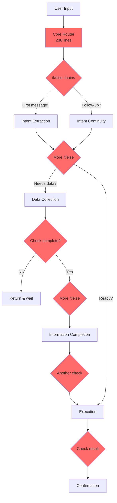

### Issues:
- 🔴 **Manual routing** - Every path hardcoded
- 🔴 **3 state variables** - Synchronization bugs
- 🔴 **Duplicate patterns** - Same code repeated 5+ times
- 🔴 **High complexity** - Cyclomatic complexity of 15
- 🔴 **Hard to test** - Tightly coupled logic

---

## ✨ After: Declarative Architecture

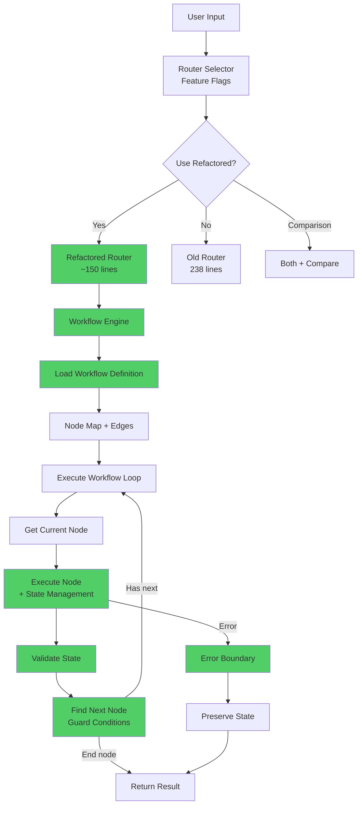

### Benefits:
- ✅ **Data-driven routing** - Workflows are data
- ✅ **Single state** - No synchronization issues
- ✅ **Reusable patterns** - DRY principles
- ✅ **Low complexity** - Cyclomatic complexity of ~6
- ✅ **Highly testable** - Isolated components

---

## 🔄 Workflow Engine Flow

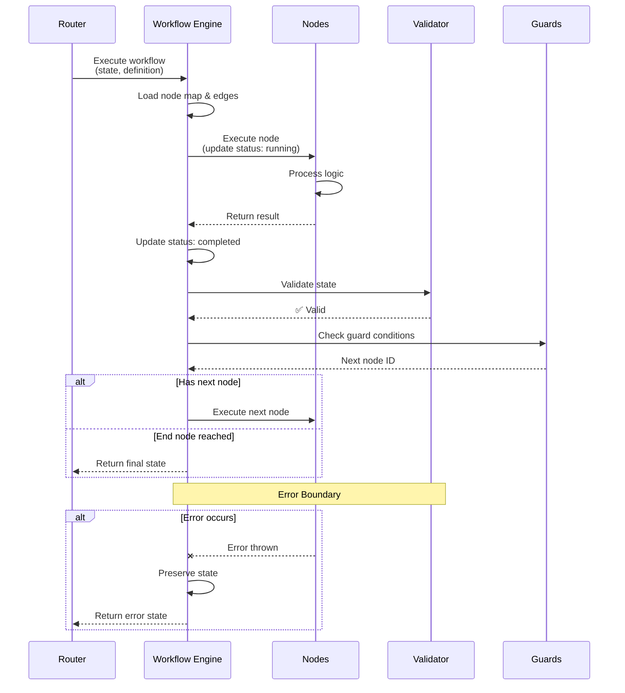

---

## 🎯 Node Execution Pattern

### Before (Repeated 5+ times):
```typescript
// ❌ Duplicate pattern everywhere
let currentState = updateNodeStatus(state, 'node_name', 'running');
const result = await node.execute({ value: state, state: currentState });
currentState = updateNodeStatus(result.state, 'node_name', 'completed');
result.state = currentState;
logger.nodeComplete(...);
```

### After (Single reusable function):
```typescript
// ✅ Extracted to executeNode()
async function executeNode(node, state, sessionId, workflowName, stepNumber) {
  logger.nodeStart(...);
  const runningState = updateNodeStatus(state, node.id, 'running');
  const result = await node.execute({ value: runningState, state: runningState });
  const completedState = updateNodeStatus(result.state, node.id, 'completed');
  logger.nodeComplete(...);
  return { value: result.value, state: completedState };
}
```

---

## 🌐 Workflow Definition Structure

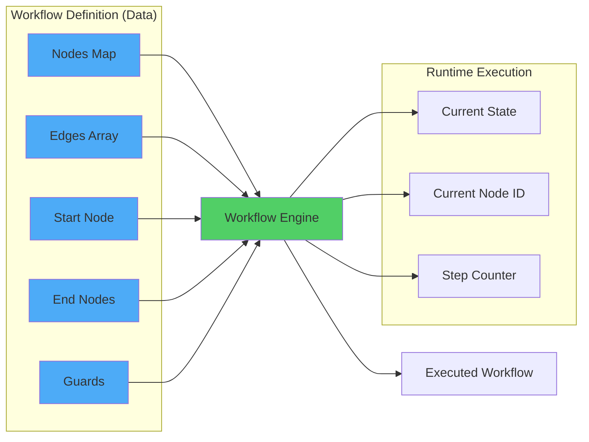

---

## 🔀 Routing Decision Tree

### Old: Imperative Routing
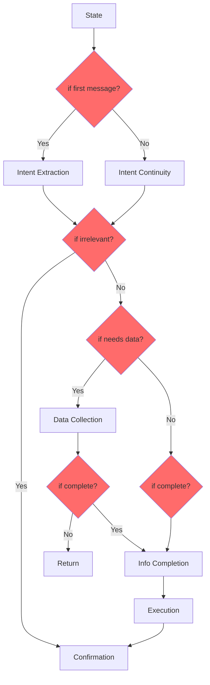

### New: Guard-based Routing
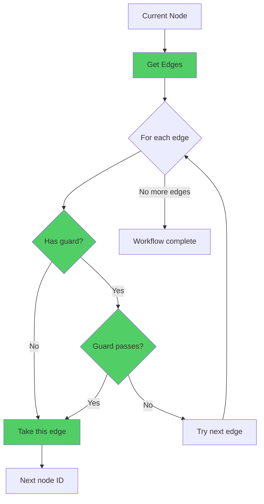

---

## 📊 State Flow Comparison

### Before: Multiple State Variables
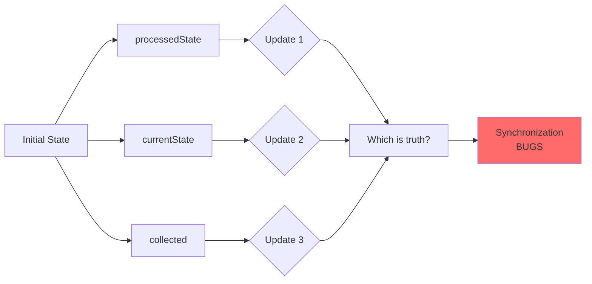

### After: Single State Flow
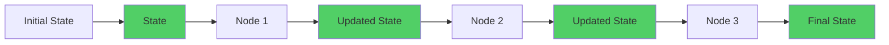

---

## 🧪 Testing Architecture

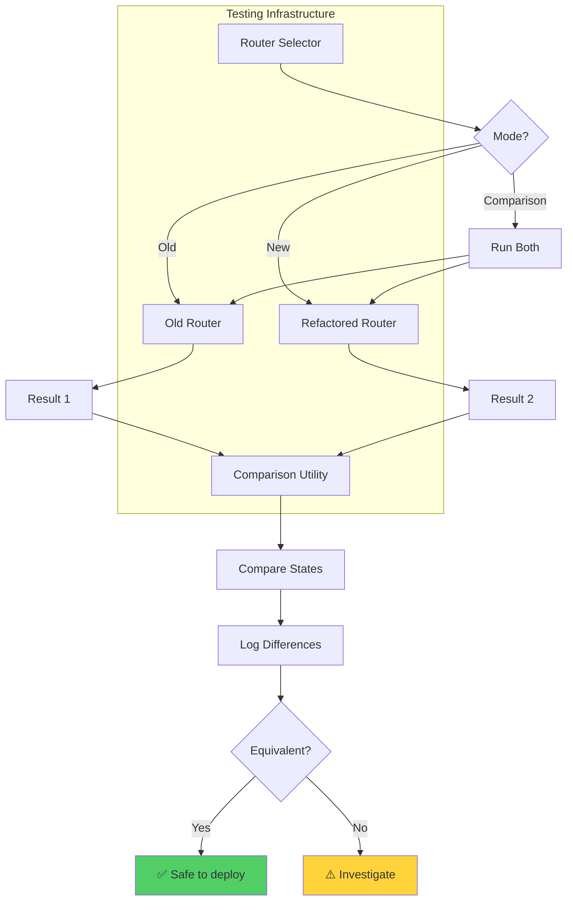

---

## 🚀 Deployment Strategy

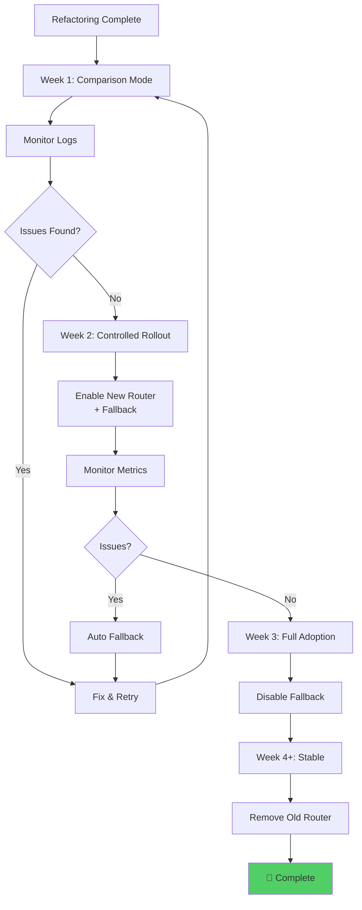

---

## 📈 Complexity Reduction

### Before: Cyclomatic Complexity = 15
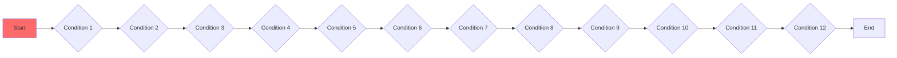

### After: Cyclomatic Complexity = ~6
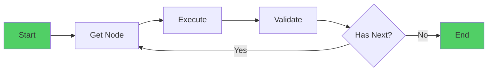

---

## 🏗️ Layer Architecture

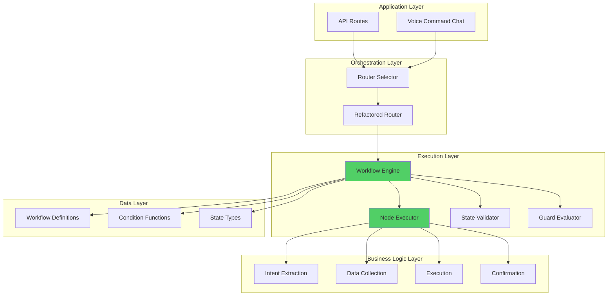

---

## 🎯 Summary

The refactored architecture achieves:

1. **Separation of Concerns** ✅
   - Workflow definition (data)
   - Workflow engine (execution)
   - Business logic (nodes)

2. **Testability** ✅
   - Isolated components
   - Comparison utilities
   - Feature flags

3. **Maintainability** ✅
   - Reduced complexity
   - No duplication
   - Clear structure

4. **Extensibility** ✅
   - Easy to add nodes
   - Easy to modify flow
   - Reusable engine

5. **Reliability** ✅
   - Error boundaries
   - State validation
   - Graceful degradation

